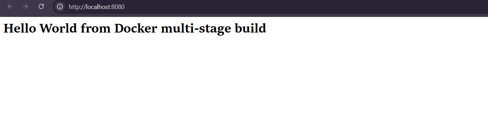
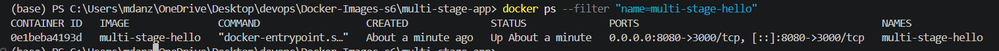

# Docker Images

**Name:** Anzar, 24BCS10289

## Multi-stage Node.js image

## Build and run

```bash
cd "Docker Images/multi-stage-app"
docker build -t multi-stage-hello .
docker run -d --name multi-stage-hello -p 8080:3000 multi-stage-hello
```
The  message appeared when I opened `http://localhost:8080` in the browser.


```bash
docker ps --filter "name=multi-stage-hello"
```


The first stage in the Dockerfile prepares the application files. The final stage copies only the files needed to run the server using `COPY --from=builder`.
