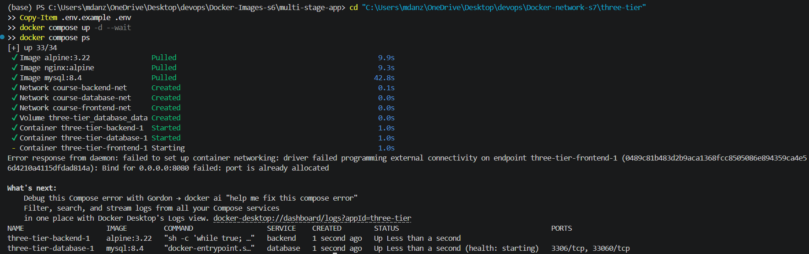
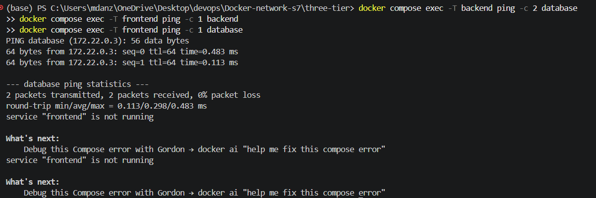
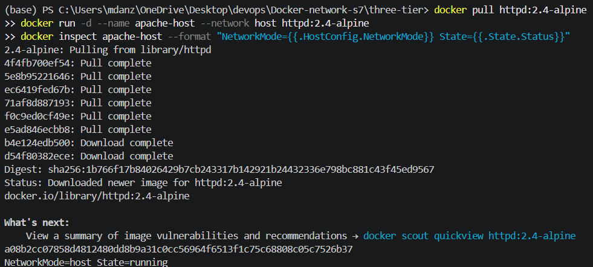
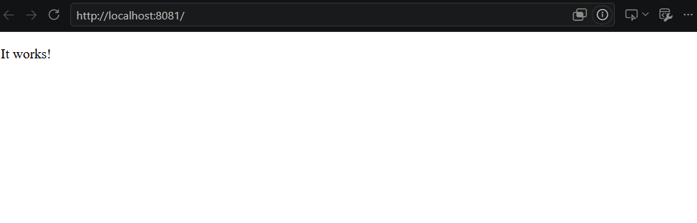
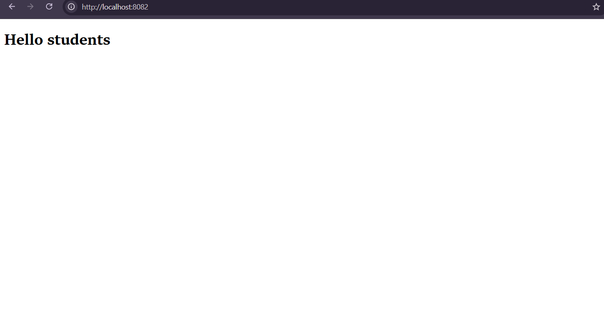
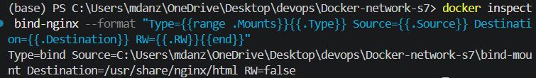
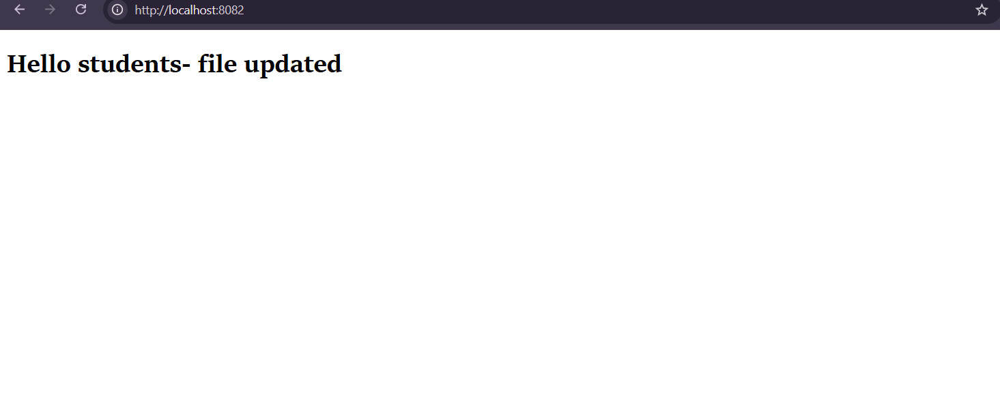

# Docker Networking and Bind Mounts

**Name:** Anzar, 24BCS10289

## 1. Container networking
| Container | Image | Networks |
| --- | --- | --- |
| `frontend` | `nginx:alpine` | `course-frontend-net` |
| `backend` | `alpine:3.22` | `course-frontend-net`, `course-backend-net` |
| `database` | `mysql:8.4` | `course-backend-net`, `course-database-net` |

I started the containers with:

```bash
cd three-tier
cp .env.example .env
docker compose up -d --wait
docker compose ps
```
```bash
docker network ls --format '{{.Name}}' | grep '^course-'

for network in course-frontend-net course-backend-net course-database-net; do
  printf '%s: ' "$network"
  docker network inspect "$network" --format '{{range .Containers}}{{.Name}} {{end}}'
done
```


### Connectivity checks

```bash
docker compose exec -T frontend ping -c 2 backend
docker compose exec -T backend ping -c 2 database
docker compose exec -T frontend ping -c 1 database
```



## 2. Apache with the host network
```bash
docker pull httpd:2.4-alpine
docker run -d --name apache-host --network host httpd:2.4-alpine
docker inspect apache-host --format 'NetworkMode={{.HostConfig.NetworkMode}} State={{.State.Status}}'
curl http://localhost:80
```





## 3. Nginx bind mount
```bash
docker run -d \
  --name bind-nginx \
  -p 8082:80 \
  --mount type=bind,src="$PWD/bind-mount",dst=/usr/share/nginx/html,readonly \
  nginx:alpine
```



```bash
docker inspect bind-nginx --format '{{range .Mounts}}{{.Type}} {{.Source}} -> {{.Destination}} RW={{.RW}}{{end}}'
docker inspect bind-nginx --format 'StartedAt={{.State.StartedAt}} RestartCount={{.RestartCount}}'
curl -s http://localhost:8082 | grep '<h1>'
```


