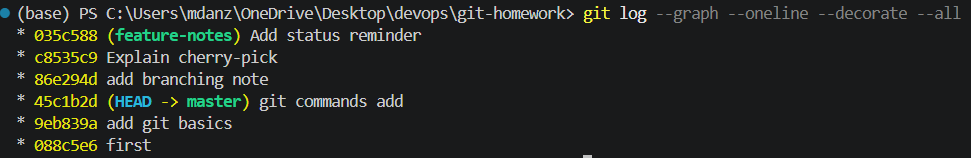

# Git and GitHub

**Name:** Anzar, 24BCS10289
## 1. `git commit -a -m` vs `git commit -m`

| Command | What it does |
| --- | --- |
| `git commit -m "message"` | Commits changes that were already added with `git add`. |
| `git commit -a -m "message"` | Adds modified and deleted tracked files, then commits them. |

The `-a` option does not add new untracked files. New files still need `git add`.
```
git status --short
 M README.md
git commit -a -m "Add Git basics"
[main 836bca1] Add Git basics
 1 file changed, 2 insertions(+)
```

## 2. Create commits on `main`
```
git log --oneline --decorate -3
7292894 (HEAD -> main) Document Git commands
836bca1 Add Git basics
3f65ea2 Create Git practice lab
```

## 3. Create a branch and add commits

```bash
git switch -c feature-notes
Switched to a new branch 'feature-notes'
```
```
git log --oneline --decorate -3
5f0b9b2 (HEAD -> feature-notes) Add status reminder
0ea9897 Explain cherry-pick
7daff05 Add branching note
```

## 4. Cherry-pick one commit
```
git switch main
Switched to branch 'main'
git cherry-pick 0ea9897
[main 09a3b5e] Explain cherry-pick
 Date: Mon Aug 31 18:37:49 2026 +0530
 1 file changed, 3 insertions(+)
 create mode 100644 cherry-pick.md
```

The new commit has a different hash because it was added to a different branch history.

## 5. Final history

```
git log --graph --oneline --decorate --all
* 5f0b9b2 (feature-notes) Add status reminder
* 0ea9897 Explain cherry-pick
* 7daff05 Add branching note
| * 09a3b5e (HEAD -> main) Explain cherry-pick
|/
* 7292894 Document Git commands
* 836bca1 Add Git basics
* 3f65ea2 Create Git practice lab
```

The graph shows both branches and the commit copied to `main` with `cherry-pick`.



