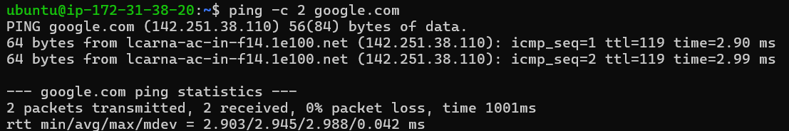
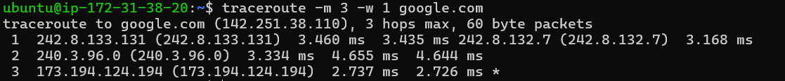
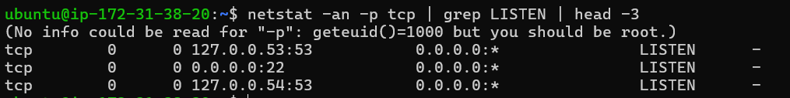
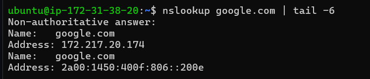
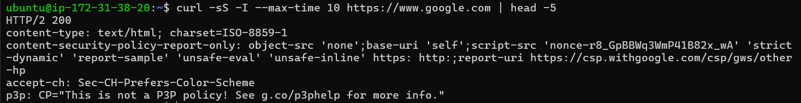

# Networking Fundamentals

**Name:** Anzar, 10289

## 1. Ping

`ping` checks whether a website can be reached and shows the response time.

```bash
ping -c 2 google.com
```


## 2. Traceroute

`traceroute` shows the routers that a connection passes through on the way to Google.

```bash
traceroute -m 3 -w 1 google.com
```


## 3. Listening TCP ports

`netstat` displays the ports that are waiting for network connections.

```bash
netstat -an -p tcp | grep LISTEN | head -3
```


## 4. DNS lookup

`nslookup` checks whether DNS can find the IP addresses for a website.

```bash
nslookup google.com | tail -6
```


## 5. HTTP check

`curl` checks whether an HTTPS request to Google receives a response.

```bash
curl -sS -I --max-time 10 https://www.google.com | head -5
```


## Networking Concepts

### How a request travels

When I open a website, DHCP gives my device network details such as an IP address, gateway, and DNS server. DNS finds the website's IP address. Switches move data inside the local network, while routers move it between networks. TCP or UDP sends the data to the right port.

### OSI model

- Layer 1 sends signals through cables, fibre, or Wi-Fi.
- Layer 2 uses frames and MAC addresses. Switches work here.
- Layer 3 uses IP addresses and routing. Routers work here.
- Layer 4 uses TCP, UDP, and port numbers.
- Layers 5-7 handle sessions, data format, security, and apps like DNS and HTTPS.

### IP addresses and subnetting

An IPv4 address has a network part and a device part. In `/24`, the first 24 bits identify the network. Subnetting breaks a large network into smaller ones, so each part has fewer usable devices.

### DHCP and troubleshooting

DHCP uses DORA: Discover, Offer, Request, and Acknowledgement. NetFlow and IPFIX help monitor traffic, while NTP keeps device clocks in sync. When something fails, I check the connection, route, ports, DNS, and then the application.
