# Kubernetes Storage, HPA and Probes

Name: Anzar
Enrollment Number: 24BCS10289

This session covers temporary volumes, persistent storage, automatic scaling,
and health checks for Kubernetes applications.

## 1. Kubernetes Volumes

The `01-kubernetes-volumes` folder contains two examples:

- `emptydir-pod.yaml` gives a Pod temporary storage. The data lasts while the
  Pod exists, but it is removed when the Pod is recreated.
- `hostpath-pod.yaml` mounts a directory from the Kubernetes node. This is
  useful for local practice, but it is not normally the best choice for
  production storage.

```bash
kubectl apply -f 01-kubernetes-volumes/emptydir-pod.yaml
kubectl get pods
kubectl describe pod emptydir-demo
kubectl delete -f 01-kubernetes-volumes/emptydir-pod.yaml
```

## 2. PersistentVolume and PersistentVolumeClaim

The `02-persistent-storage` folder shows how a Pod can use storage that is
independent of the Pod lifecycle.

- `pv.yaml` creates a PersistentVolume.
- `pvc.yaml` requests storage from the cluster.
- `pod.yaml` mounts the claim at `/data`.

```bash
kubectl apply -f 02-persistent-storage/pv.yaml
kubectl apply -f 02-persistent-storage/pvc.yaml
kubectl apply -f 02-persistent-storage/pod.yaml
kubectl get pv
kubectl get pvc
kubectl get pods
```

To test that the data remains after the Pod is recreated:

```bash
kubectl exec -it storage-demo -- sh
echo "Kubernetes Storage" > /data/message.txt
cat /data/message.txt
exit
kubectl delete pod storage-demo
kubectl apply -f 02-persistent-storage/pod.yaml
kubectl exec storage-demo -- cat /data/message.txt
```

## 3. StorageClass

The `03-storageclass` folder contains a claim that can use the cluster's
default StorageClass. A StorageClass can dynamically create storage instead
of requiring every PersistentVolume to be created by hand.

```bash
kubectl get storageclass
kubectl apply -f 03-storageclass/pvc.yaml
kubectl get pvc
kubectl describe pvc <claim-name>
```

The exact result depends on the storage provisioner configured in the local
cluster.

## 4. Horizontal Pod Autoscaler

The `04-hpa` folder contains a Deployment, Service, and HPA. The HPA changes
the number of Pod replicas when CPU usage passes the configured target.

```bash
kubectl apply -f 04-hpa/deployment.yaml
kubectl apply -f 04-hpa/service.yaml
kubectl apply -f 04-hpa/hpa.yaml
kubectl get deployment
kubectl get pods
kubectl get hpa
kubectl describe hpa <hpa-name>
```

Metrics Server must be available before the HPA can read CPU usage. In
Minikube, it can be enabled with:

```bash
minikube addons enable metrics-server
```

My cluster was actually a kind cluster, not Minikube, so the addon didn't do
anything and `kubectl top pods` kept saying "Metrics API not available". On
kind I had to install metrics-server myself and add the
`--kubelet-insecure-tls` flag, otherwise it doesn't start properly:

```bash
kubectl apply -f https://github.com/kubernetes-sigs/metrics-server/releases/latest/download/components.yaml
kubectl patch deployment metrics-server -n kube-system --type=json -p "[{\"op\":\"add\",\"path\":\"/spec/template/spec/containers/0/args/-\",\"value\":\"--kubelet-insecure-tls\"}]"
```

After about a minute `kubectl top pods` started showing numbers. Before this,
the HPA showed `cpu: <unknown>/50%` (see the first HPA screenshot below).

### Load test

The `hpa` folder has a load generator. It runs 3 busybox pods that keep
sending requests to `hpa-demo-service`, so the nginx pod's CPU goes up and
the HPA starts adding replicas.

I used two terminals for this. In the first one I started the load and kept
watching the HPA:

```bash
kubectl apply -f hpa/load-generator.yaml
kubectl get hpa hpa-demo -w
```

In the second one I checked CPU usage and the pods:

```bash
kubectl top pods
kubectl get pods
kubectl describe hpa hpa-demo
```

If the CPU doesn't go above 50%, add more load:

```bash
kubectl scale deployment load-generator --replicas=6
```

After stopping the load, the HPA takes around 5 minutes to scale back down
to 1 pod:

```bash
kubectl delete -f hpa/load-generator.yaml
kubectl get hpa hpa-demo -w
```

## 5. Health Probes

The `05-probes` folder demonstrates the three main health checks:

- A liveness probe restarts a container that is no longer healthy.
- A readiness probe removes a Pod from Service traffic until it is ready.
- A startup probe gives a slow application time to start before other probes
  begin checking it.

```bash
kubectl apply -f 05-probes/liveness.yaml
kubectl apply -f 05-probes/readiness.yaml
kubectl apply -f 05-probes/startup.yaml
kubectl get pods
kubectl describe pod <pod-name>
```

## 6. Mini Project

The `mini-project` folder combines a Namespace, Deployment, Service, PVC, and
HPA into one small example.

```bash
kubectl apply -f mini-project/namespace.yaml
kubectl apply -f mini-project/pvc.yaml
kubectl apply -f mini-project/deployment.yaml
kubectl apply -f mini-project/service.yaml
kubectl apply -f mini-project/hpa.yaml
kubectl get all -n production-webapp
kubectl get pvc -n production-webapp
kubectl get hpa -n production-webapp
```

## Screenshots

The screenshots below show the completed practice work:

### EmptyDir volume

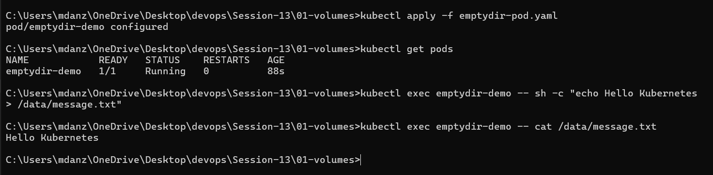

### HostPath volume

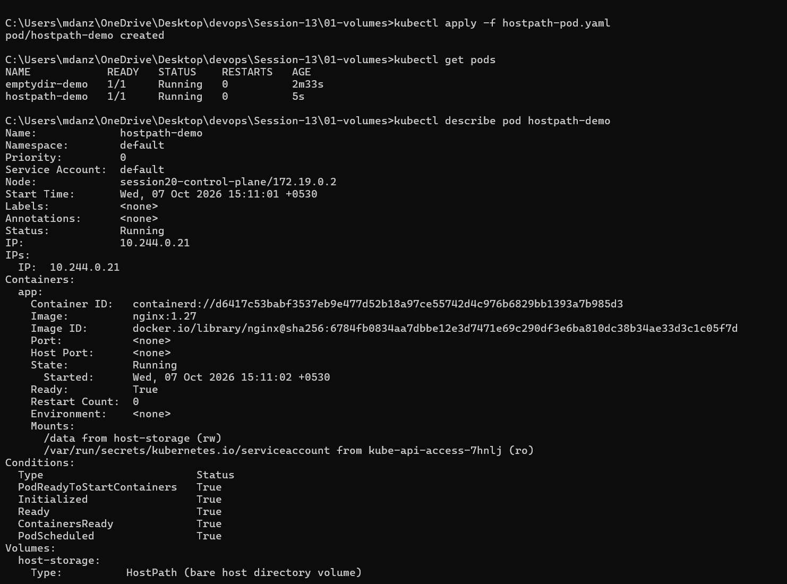

### PersistentVolume and PersistentVolumeClaim

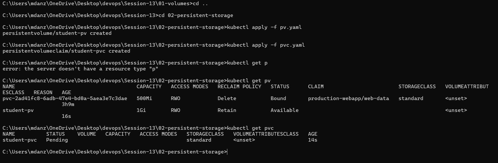

### Persistent data after Pod recreation

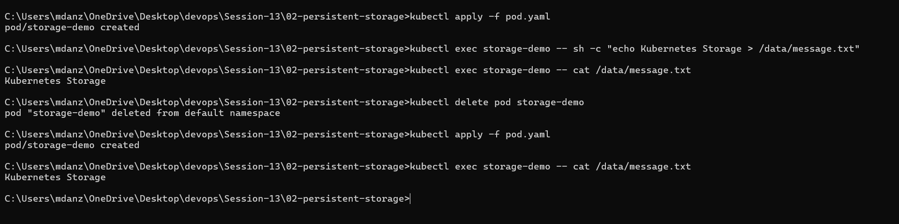

### StorageClass

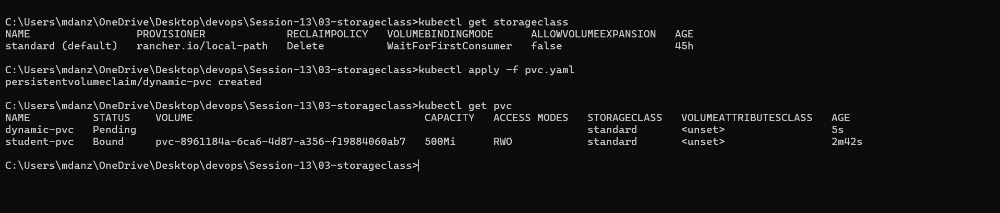

### HPA status

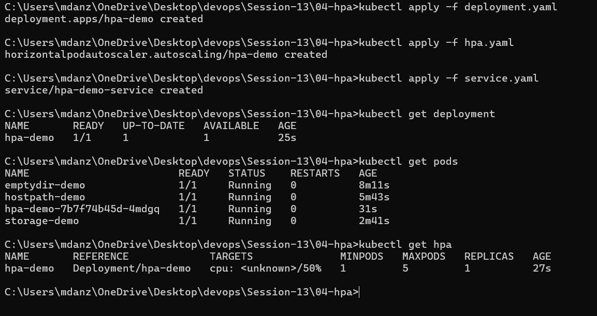

### HPA under load

Once the load generator started, CPU jumped from 6% to around 195% of the
target and the HPA went from 1 pod to 4, then to 5 (the max I set):

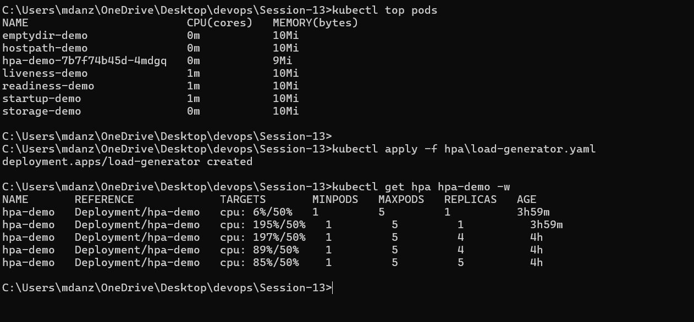

With 5 pods the load got spread out, each hpa-demo pod was sitting around
55m CPU. The load-generator pods themselves were using a lot more:

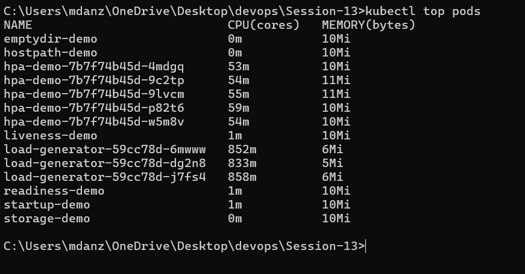

The events at the bottom of `describe hpa` show both scale-ups. The
`FailedGetResourceMetric` warning is from before metrics-server was set up.
`ScalingLimited` is true because it wanted more than 5 pods but couldn't go
past `maxReplicas`:

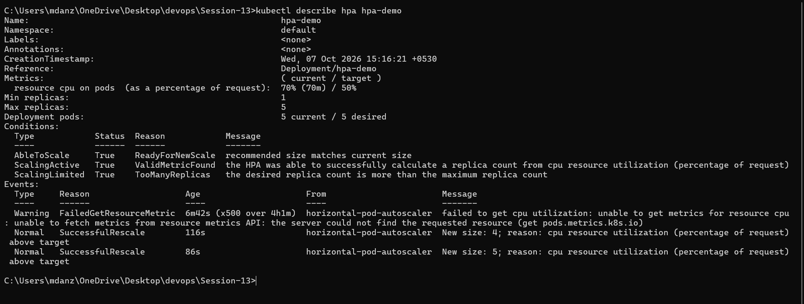

### Health probes

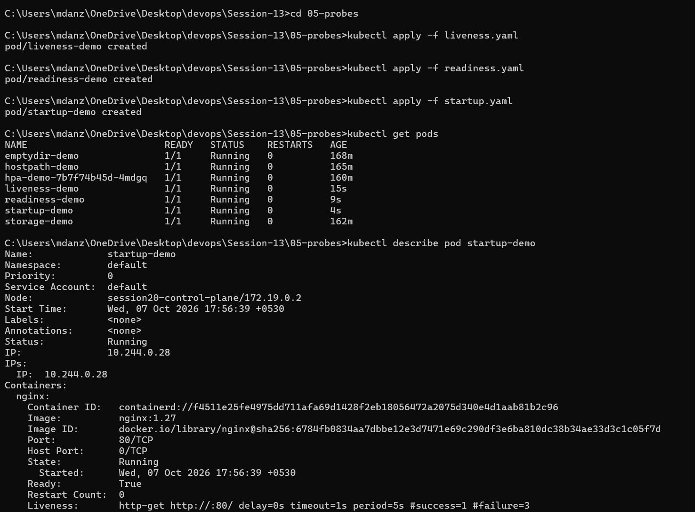
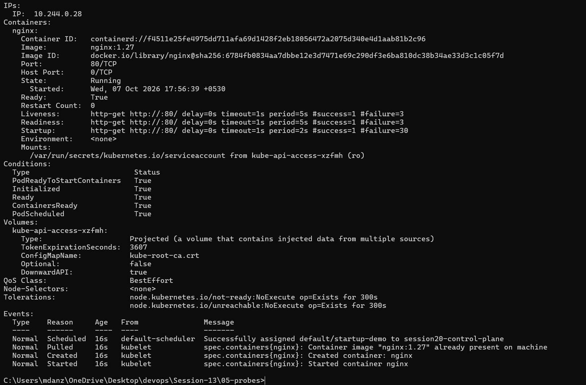

### Mini-project

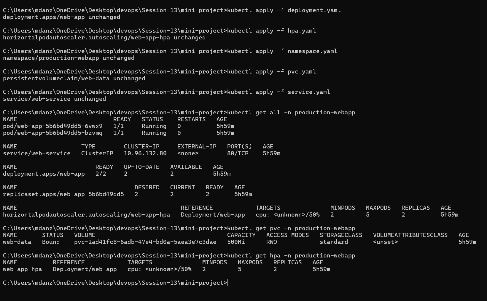

## Cleanup

Remove practice resources after taking the screenshots:

```bash
kubectl delete -f 01-kubernetes-volumes/emptydir-pod.yaml
kubectl delete -f 02-persistent-storage/pod.yaml
kubectl delete -f 02-persistent-storage/pvc.yaml
kubectl delete -f 02-persistent-storage/pv.yaml
kubectl delete -f hpa/load-generator.yaml
kubectl delete -f 04-hpa/hpa.yaml
kubectl delete -f 04-hpa/service.yaml
kubectl delete -f 04-hpa/deployment.yaml
kubectl delete -f 05-probes/liveness.yaml
kubectl delete -f 05-probes/readiness.yaml
kubectl delete -f 05-probes/startup.yaml
kubectl delete -f mini-project -n production-webapp
kubectl delete namespace production-webapp
```

## Conclusion

Volumes provide storage to containers. PersistentVolumeClaims keep application
data separate from a Pod's lifetime. HPA adds replicas when demand increases,
and probes help Kubernetes decide when a container should receive traffic or
be restarted.
