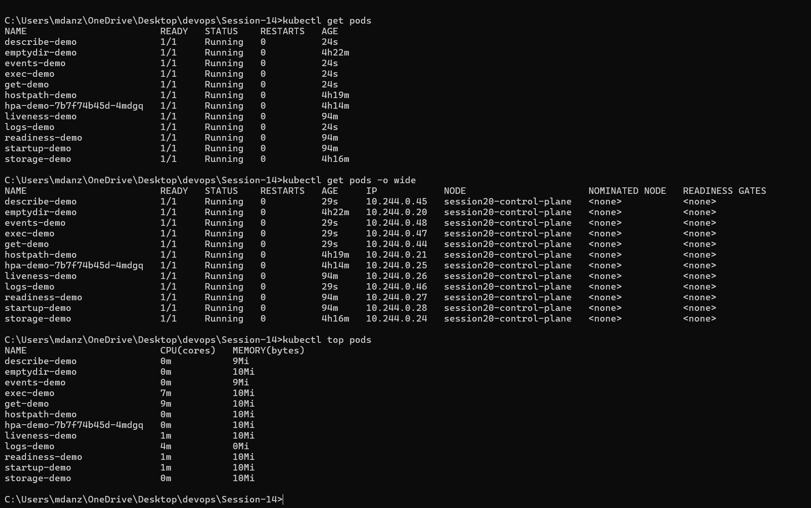
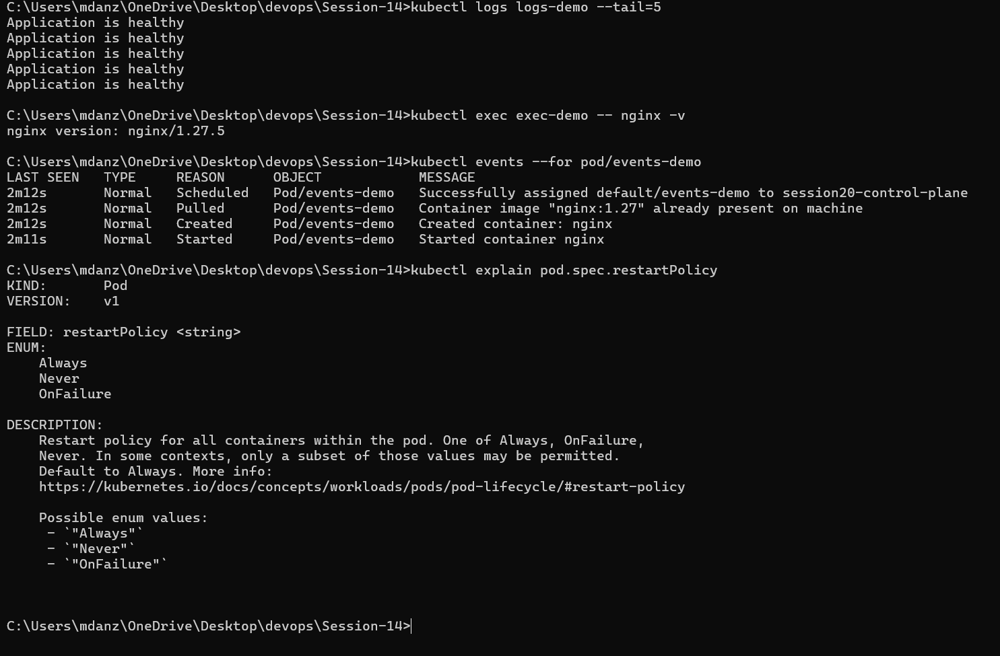
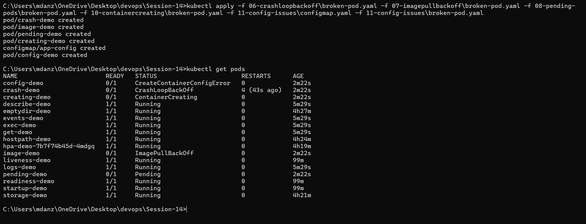
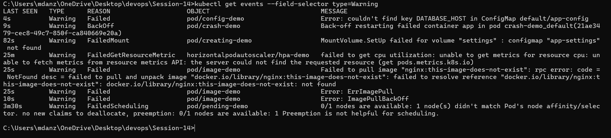
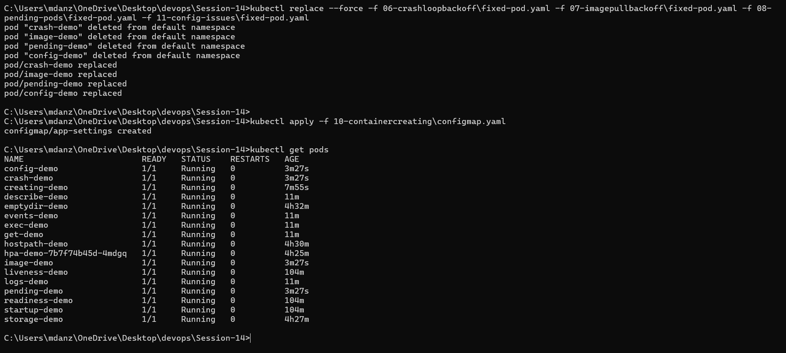
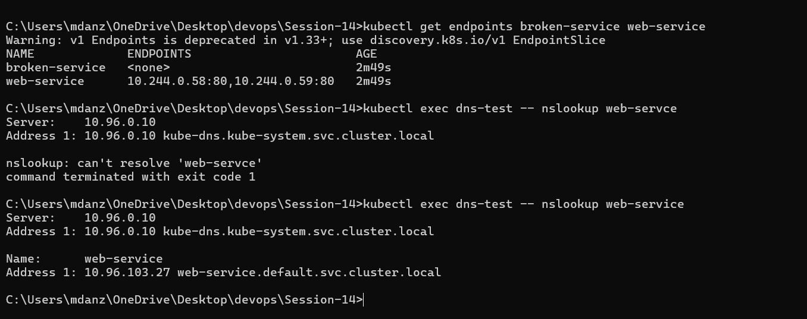
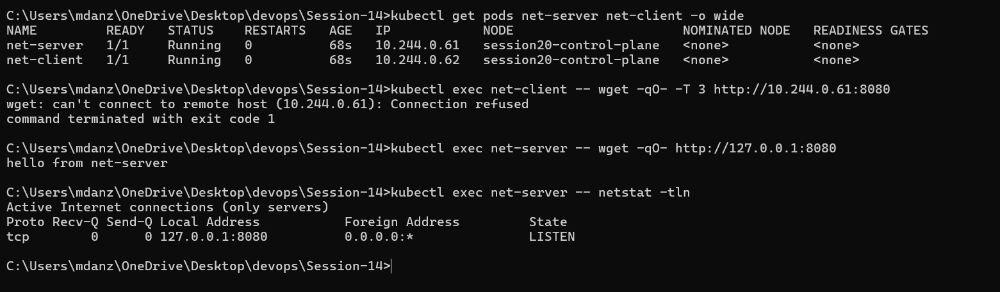
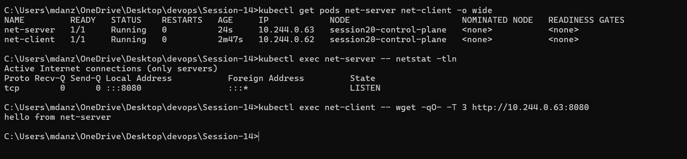
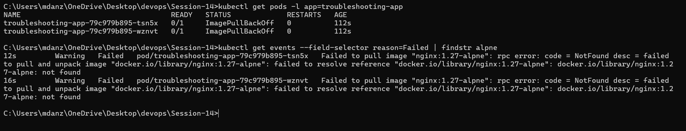
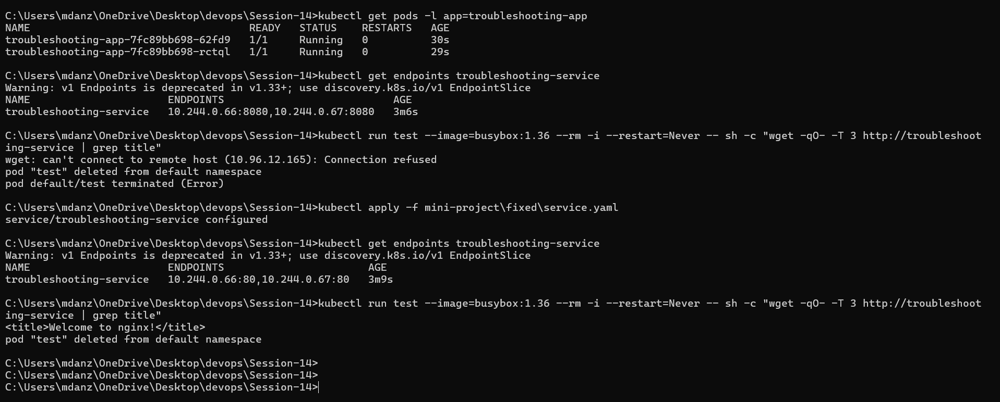

# Kubernetes Troubleshooting

Name: Anzar
Enrollment Number: 24BCS10289

This session was about figuring out why something in Kubernetes isn't working.
I broke things on purpose, then found and fixed the problem using kubectl.

The order I followed for every problem:

```text
get -> describe -> events -> logs -> exec -> fix -> verify
```

Pods whose spec can't be edited in place (like `command` or `env`) were fixed
with `kubectl replace --force -f <file>`, which deletes the Pod and creates it
again from the fixed file.

## Folder structure

| Folder | What it covers |
|---|---|
| `01` to `05` | Basic troubleshooting commands |
| `06-crashloopbackoff` | Container keeps crashing |
| `07-imagepullbackoff` | Wrong image tag (ErrImagePull / ImagePullBackOff) |
| `08-pending-pods` | Pod can't be scheduled |
| `09-service-dns-troubleshooting` | Service with no endpoints, DNS lookups |
| `10-containercreating` | Pod stuck in ContainerCreating |
| `11-config-issues` | Wrong ConfigMap key |
| `12-pod-networking` | App not reachable from other Pods |
| `mini-project` | Broken app with two problems, plus the fixed version |
| `scenarios` | Extra practice Pods (not part of the main work) |

---

## Task 1: Troubleshooting commands

I created the demo Pods first:

```bash
kubectl apply -f 01-kubectl-get/pod.yaml
kubectl apply -f 02-kubectl-describe/demo-pod.yaml
kubectl apply -f 03-kubectl-logs/pod.yaml
kubectl apply -f 04-kubectl-exec/pod.yaml
kubectl apply -f 05-events/pod.yaml
```

| Command | What I used it for |
|---|---|
| `kubectl get pods` | Quick status of all Pods (Running, Pending, CrashLoopBackOff...) |
| `kubectl get pods -o wide` | Same, plus the Pod IP and which node it's on |
| `kubectl describe pod describe-demo` | Full details. The Events part at the bottom is usually where the answer is |
| `kubectl logs logs-demo --tail=5` | What the app printed. `--previous` shows logs from the last crashed container |
| `kubectl exec exec-demo -- nginx -v` | Run a command inside the container. `-it ... -- sh` gives a full shell |
| `kubectl events --for pod/events-demo` | Events for one resource, in order |
| `kubectl explain pod.spec.restartPolicy` | Built-in docs for any YAML field. Useful when I forget a field name |
| `kubectl top pods` | CPU and memory per Pod (needs metrics-server) |





---

## Task 2: Common issues

To save time I applied all the broken Pods together, so one `kubectl get pods`
showed every error at once. Then I went through them one by one. The warning
events gave away the root cause for most of them:

```bash
kubectl get pods
kubectl get events --field-selector type=Warning
```

After fixing everything, all of them were Running.







The details for each one are below.

### 1. CrashLoopBackOff

**Problem:** `crash-demo` keeps restarting and the status shows CrashLoopBackOff.

**Investigation:**

```bash
kubectl apply -f 06-crashloopbackoff/broken-pod.yaml
kubectl get pods
kubectl logs crash-demo --previous
kubectl describe pod crash-demo
```

**Root cause:** the container prints "Something went wrong!" and runs
`exit 1`. Kubernetes restarts it, it fails again, and the wait between
restarts keeps getting longer. That's the "BackOff" part.

**Fix and verify:**

```bash
kubectl replace --force -f 06-crashloopbackoff/fixed-pod.yaml
kubectl get pods
```

### 2. ErrImagePull / ImagePullBackOff

**Problem:** `image-demo` never starts.

**Investigation:**

```bash
kubectl apply -f 07-imagepullbackoff/broken-pod.yaml
kubectl get pods -w
kubectl describe pod image-demo
```

**Root cause:** the tag `nginx:this-image-does-not-exist` doesn't exist on
Docker Hub. The first failed pull shows as **ErrImagePull**. After a few
retries Kubernetes waits longer between them and the status changes to
**ImagePullBackOff**. They're the same problem, just at different stages.

**Fix and verify:** changed the image to `nginx:1.27`.

```bash
kubectl apply -f 07-imagepullbackoff/fixed-pod.yaml
kubectl get pods
```

### 3. Pending

**Problem:** `pending-demo` stays in Pending and never gets a node.

**Investigation:**

```bash
kubectl apply -f 08-pending-pods/broken-pod.yaml
kubectl get pods -o wide
kubectl describe pod pending-demo
```

**Root cause:** the Pod has a `nodeSelector` asking for a node called
`node-that-does-not-exist`. The scheduler can't find a matching node, so the
event says `FailedScheduling ... didn't match Pod's node affinity/selector`.

**Fix and verify:** removed the `nodeSelector`.

```bash
kubectl replace --force -f 08-pending-pods/fixed-pod.yaml
kubectl get pods -o wide
```

### 4. ContainerCreating

**Problem:** `creating-demo` is stuck in ContainerCreating.

**Investigation:**

```bash
kubectl apply -f 10-containercreating/broken-pod.yaml
kubectl get pods
kubectl describe pod creating-demo
```

**Root cause:** the Pod mounts a ConfigMap called `app-settings` as a volume,
but that ConfigMap was never created. The events show `FailedMount ...
configmap "app-settings" not found`. The container can't start until the
volume is ready.

**Fix and verify:** created the missing ConfigMap. The Pod didn't need to be
recreated, the kubelet keeps retrying the mount and it started on its own.

```bash
kubectl apply -f 10-containercreating/configmap.yaml
kubectl get pods
```

### 5. Configuration issue

**Problem:** `config-demo` shows `CreateContainerConfigError`.

**Investigation:**

```bash
kubectl apply -f 11-config-issues/configmap.yaml
kubectl apply -f 11-config-issues/broken-pod.yaml
kubectl get pods
kubectl describe pod config-demo
kubectl get configmap app-config -o yaml
```

**Root cause:** the Pod reads the key `DATABASE_HOST` from the `app-config`
ConfigMap, but the ConfigMap only has `DB_HOST`. The event says
`couldn't find key DATABASE_HOST in ConfigMap default/app-config`.

**Fix and verify:** changed the key to `DB_HOST`.

```bash
kubectl replace --force -f 11-config-issues/fixed-pod.yaml
kubectl get pods
kubectl logs config-demo
```

### 6. Service connectivity

**Problem:** `broken-service` exists but nothing behind it responds.

**Investigation:**

```bash
kubectl apply -f 09-service-dns-troubleshooting/deployment.yaml
kubectl apply -f 09-service-dns-troubleshooting/broken-service.yaml
kubectl get pods --show-labels
kubectl describe service broken-service
kubectl get endpoints broken-service
```

**Root cause:** the Service selector is `app: does-not-exist`, but the Pods
are labelled `app: web`. No Pods match, so the endpoints list is empty and the
Service has nowhere to send traffic.

**Fix and verify:** `web-service` uses the correct selector `app: web`. Its
endpoints show both Pod IPs.

```bash
kubectl apply -f 09-service-dns-troubleshooting/service.yaml
kubectl get endpoints web-service
```

### 7. DNS

**Problem:** a Pod can't resolve the Service name.

**Investigation:**

```bash
kubectl apply -f 09-service-dns-troubleshooting/dns-test-pod.yaml
kubectl exec dns-test -- nslookup web-servce
kubectl get pods -n kube-system -l k8s-app=kube-dns
kubectl exec dns-test -- cat /etc/resolv.conf
```

**Root cause:** the name was typed wrong (`web-servce`), so nslookup says
`can't resolve 'web-servce'`. CoreDNS itself is running fine, and
`resolv.conf` points at the cluster DNS, so DNS isn't broken. The name is.

Side note: the test Pod first used the `dnsutils:1.3` image, which turned out
to not exist anymore, so the Pod itself went into ImagePullBackOff. I switched
it to `busybox:1.28`, which has a working `nslookup`.

**Fix and verify:** used the right short name and the full FQDN.

```bash
kubectl exec dns-test -- nslookup web-service
kubectl exec dns-test -- nslookup web-service.default.svc.cluster.local
```



### 8. Pod networking

**Problem:** `net-server` is Running, but `net-client` gets
"Connection refused" when it calls it on port 8080.

**Investigation:**

```bash
kubectl apply -f 12-pod-networking/broken-server.yaml
kubectl apply -f 12-pod-networking/client-pod.yaml
kubectl get pods -o wide
kubectl exec net-client -- wget -qO- -T 3 http://<net-server-ip>:8080
kubectl exec net-server -- wget -qO- http://127.0.0.1:8080
kubectl exec net-server -- netstat -tln
```

**Root cause:** from inside `net-server` the page loads fine, but from the
other Pod it doesn't. `netstat` shows the server listening on
`127.0.0.1:8080`, which means it only accepts connections from inside its own
container. Other Pods come in on the Pod IP, so they get refused.

**Fix and verify:** made the server listen on all interfaces (`-p 8080`
instead of `-p 127.0.0.1:8080`). The Pod IP changes after recreating, so I
checked it again first.

```bash
kubectl replace --force -f 12-pod-networking/fixed-server.yaml
kubectl get pods -o wide
kubectl exec net-client -- wget -qO- -T 3 http://<new-net-server-ip>:8080
```





---

## Task 3: Mini project

**Problem statement:** the `troubleshooting-app` Deployment and
`troubleshooting-service` were deployed, but the app can't be reached through
the Service.

```bash
kubectl apply -f mini-project/broken/deployment.yaml
kubectl apply -f mini-project/broken/service.yaml
```

**Investigation, problem 1:**

```bash
kubectl get pods -l app=troubleshooting-app
kubectl get events --field-selector reason=Failed | findstr alpne
```

The Pods were in ImagePullBackOff. The Failed events showed the image
`nginx:1.27-alpne` couldn't be pulled. It's a typo, the tag doesn't exist.

**Fix 1:** corrected the image to `nginx:1.27`.

```bash
kubectl apply -f mini-project/fixed/deployment.yaml
kubectl get pods -l app=troubleshooting-app
```

**Investigation, problem 2:** the Pods were Running now, but the Service still
didn't work.

```bash
kubectl get endpoints troubleshooting-service
kubectl run test --image=busybox:1.36 --rm -i --restart=Never -- sh -c "wget -qO- -T 3 http://troubleshooting-service | grep title"
```

The endpoints showed the Pod IPs with port **8080**, but nginx listens on
port **80**. The Service had `targetPort: 8080`, so the request reached the
Pod on a port where nothing was listening.

**Fix 2:** changed `targetPort` to 80.

```bash
kubectl apply -f mini-project/fixed/service.yaml
kubectl get endpoints troubleshooting-service
kubectl run test --image=busybox:1.36 --rm -i --restart=Never -- sh -c "wget -qO- -T 3 http://troubleshooting-service | grep title"
```

This time it returned `<title>Welcome to nginx!</title>`.

**What I learned from this one:** fixing the first problem didn't make the app
work. Pods being Running doesn't mean the Service works, so I had to check
the endpoints and test the connection myself.





---

## Extra practice

The `scenarios` folder has five more broken Pods, including an OOMKilled one.
They can all be applied at once with:

```bash
kubectl apply -R -f scenarios
kubectl get pods -l tier=triage-gauntlet
```

## Cleanup

```bash
kubectl delete -R -f . --ignore-not-found
```

## Conclusion

Most of the time the answer was in the Events section of
`kubectl describe`. The trickier cases were the ones where everything looked
Running but still didn't work, like the networking problem and the mini
project. For those I had to test the connection myself with `exec` and check
the endpoints.
