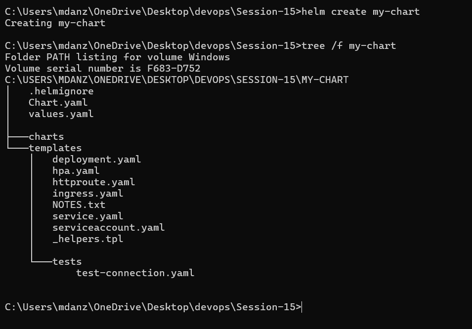
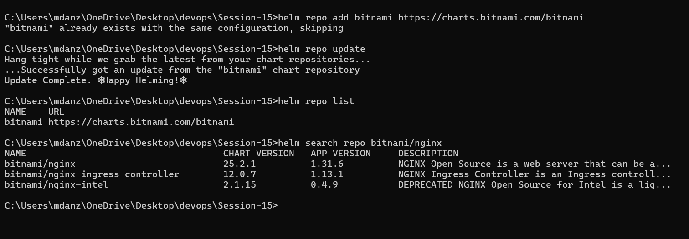
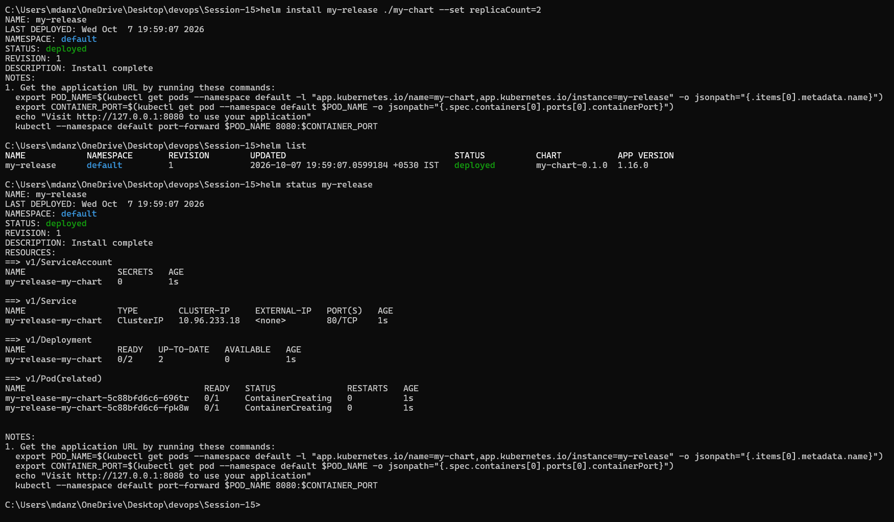
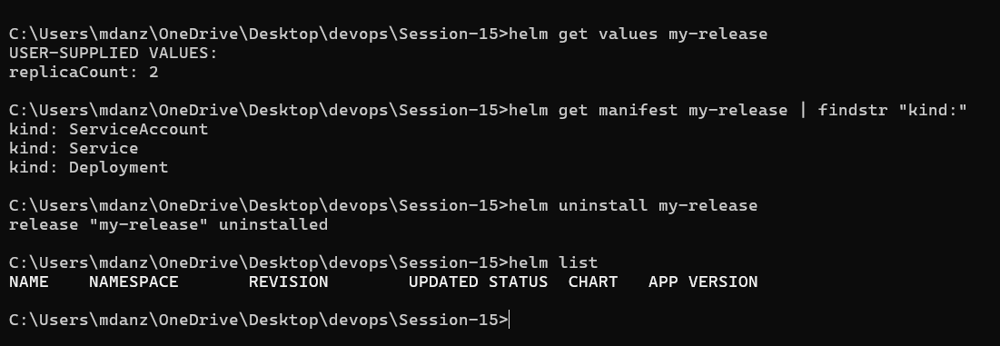
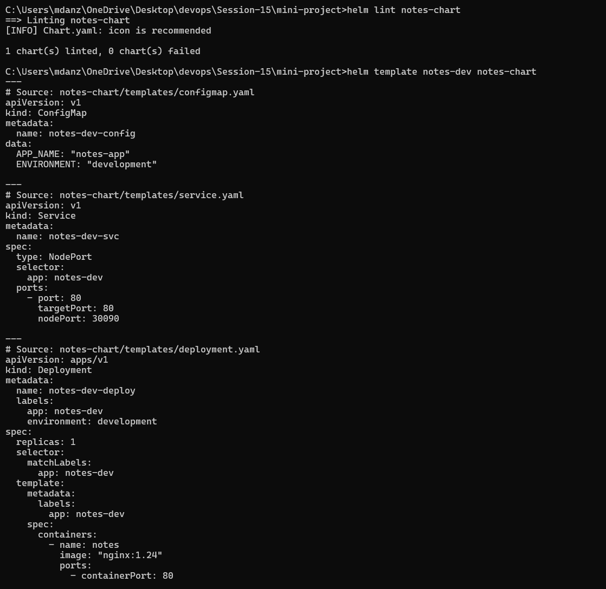
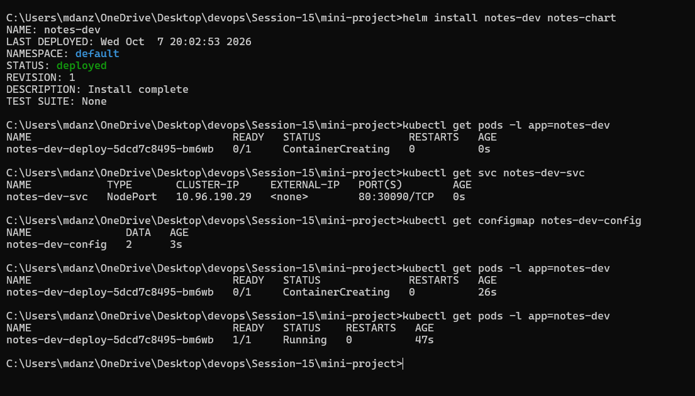
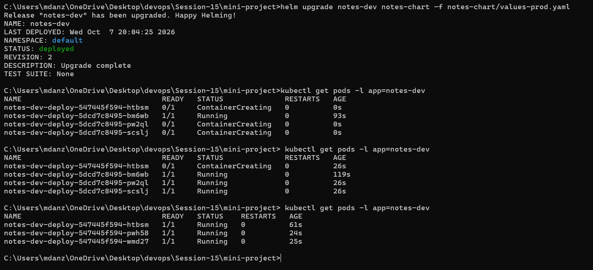
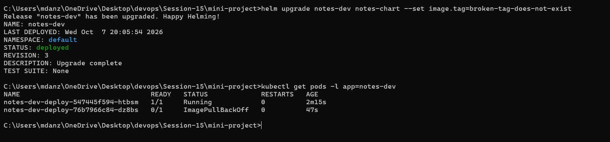
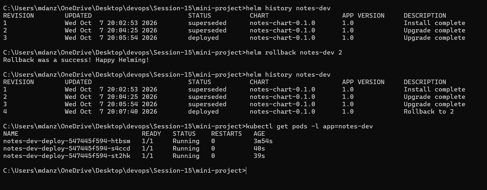

# Helm

Name: Anzar
Enrollment Number: 24BCS10289

Helm is a package manager for Kubernetes. Instead of keeping separate YAML
files for every environment, you write one chart with templates and pass
different values to it.

Three words I kept using in this session:

- **Chart**: a folder with templates and default values
- **Release**: a chart installed in the cluster under a name
- **Revision**: every install, upgrade or rollback creates a new numbered
  revision of the release

## Folder structure

```text
Session-15/
├── my-chart/              made with helm create, used for Task 1
├── mini-project/
│   └── notes-chart/       chart for the Notes app (Task 2 and Task 3)
│       ├── Chart.yaml
│       ├── values.yaml
│       ├── values-prod.yaml
│       └── templates/
│           ├── configmap.yaml
│           ├── deployment.yaml
│           └── service.yaml
└── images/
```

---

## Task 1: Helm commands

### helm create

Creates a starter chart with a Deployment, Service, HPA, Ingress and so on.

```bash
helm create my-chart
tree /f my-chart
```



### helm repo and helm search

`helm repo add` registers a chart repository, `helm repo update` downloads
its latest index, and `helm search repo` searches the repos I've added.

```bash
helm repo add bitnami https://charts.bitnami.com/bitnami
helm repo update
helm repo list
helm search repo bitnami/nginx
```



### helm install, list, status

`install` deploys the chart as a release, `list` shows all releases in the
namespace, and `status` shows the state and revision of one release.

```bash
helm install my-release ./my-chart --set replicaCount=2
helm list
helm status my-release
```



### helm get and helm uninstall

`helm get values` shows the values I passed in (here `replicaCount: 2`).
`helm get manifest` shows the actual YAML Helm sent to the cluster. I
filtered it to just the resource kinds so it fits on screen.
`helm uninstall` removes the release and everything it created.

```bash
helm get values my-release
helm get manifest my-release | findstr "kind:"
helm uninstall my-release
helm list
```



`helm upgrade`, `helm history` and `helm rollback` are shown in the next part,
where they make more sense.

| Command | What it does |
|---|---|
| `helm create` | Generates a starter chart |
| `helm repo add / update / list` | Manage chart repositories |
| `helm search repo` | Find charts in the added repos |
| `helm lint` | Checks a chart for mistakes |
| `helm template` | Renders the templates locally without installing |
| `helm install` | Installs a chart as a new release |
| `helm list` | Lists releases |
| `helm status` | Shows the state of one release |
| `helm get values / manifest` | Shows the values or rendered YAML of a release |
| `helm upgrade` | Updates a release with new values or a new chart version |
| `helm history` | Lists all revisions of a release |
| `helm rollback` | Goes back to an earlier revision |
| `helm uninstall` | Deletes the release |

---

## Task 2 and Task 3: Notes app mini project (with rollback)

The mini project already goes through the full rollback workflow from Task 2,
so I did both together:

```text
install -> upgrade -> verify -> upgrade again (bad) -> verify -> rollback -> verify
```

The chart is in `mini-project/notes-chart`. It has a ConfigMap, a Deployment
and a NodePort Service. Everything that changes between environments
(replicas, image tag, environment name) comes from the values files.

| | values.yaml (dev) | values-prod.yaml |
|---|---|---|
| replicas | 1 | 3 |
| nginx tag | 1.24 | 1.25 |
| environment | development | production |

All commands below are run from inside `Session-15/mini-project`.

### Lint and render

Before installing I checked the chart and looked at the rendered YAML to
make sure all the `{{ }}` got replaced.

```bash
helm lint notes-chart
helm template notes-dev notes-chart
```



### Install (revision 1)

```bash
helm install notes-dev notes-chart
kubectl get pods -l app=notes-dev
kubectl get svc notes-dev-svc
kubectl get configmap notes-dev-config
```

One pod running nginx 1.24.



### Upgrade to production values (revision 2)

```bash
helm upgrade notes-dev notes-chart -f notes-chart/values-prod.yaml
kubectl get pods -l app=notes-dev
```

Now there are 3 pods running nginx 1.25.



### Bad upgrade (revision 3)

To see a rollback in action I pushed an image tag that doesn't exist.

```bash
helm upgrade notes-dev notes-chart --set image.tag=broken-tag-does-not-exist
kubectl get pods -l app=notes-dev
```

The new pod went into ImagePullBackOff. Helm still said the upgrade was
`deployed`, because by default it doesn't wait to check if the pods
actually start.

Also, since I didn't pass `-f values-prod.yaml` again, Helm went back to the
default values (1 replica). Every upgrade starts from the chart defaults
unless you pass the same values again or use `--reuse-values`.



### Rollback to revision 2 (creates revision 4)

```bash
helm history notes-dev
helm rollback notes-dev 2
helm history notes-dev
kubectl get pods -l app=notes-dev
```

After the rollback there were 3 healthy pods again. The rollback didn't
remove revision 3 from the history. It created a new revision 4 that is a
copy of revision 2.



### Clean up

```bash
helm uninstall notes-dev
```

---

## Conclusion

Helm made it easy to deploy the same app with different settings just by
switching values files. The rollback part was the most useful: one command
took the app from a broken image back to a working state, and the history
kept a record of everything that happened.
