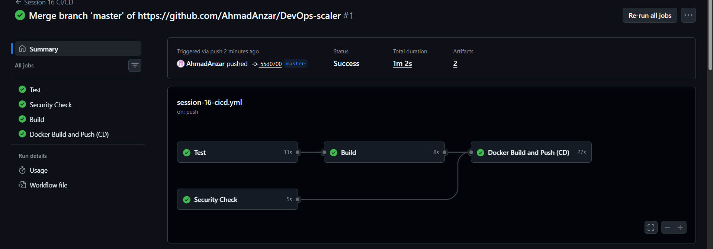
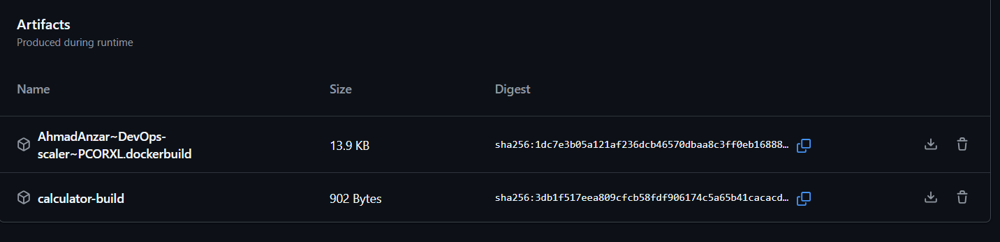
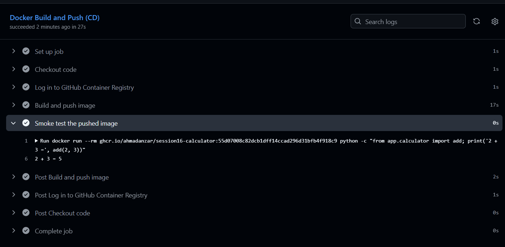
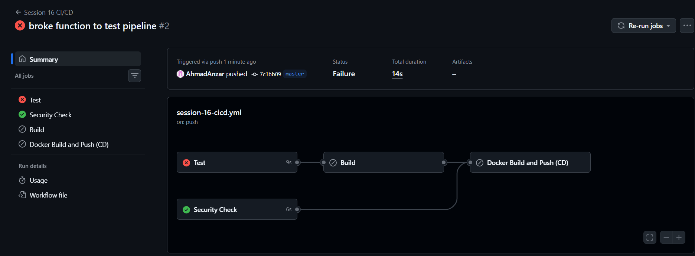

# CI/CD with GitHub Actions

Name: Anzar
Enrollment Number: 24BCS10289

For this session I built a CI/CD pipeline for a small Python calculator app,
based on the `10-final-cicd-pipeline` example from class. I added a Dockerfile
and a CD part that builds a Docker image and pushes it to GitHub Container
Registry.

## Project structure

```text
Session-16/
├── app/
│   ├── __init__.py
│   └── calculator.py        the app (add, subtract, multiply, divide)
├── tests/
│   └── test_calculator.py   5 pytest tests
├── build.sh                 copies the app into build/ with a build-info file
├── Dockerfile
├── requirements.txt
└── images/

.github/workflows/session-16-cicd.yml   (at the repo root)
```

The workflow file has to be in `.github/workflows` at the root of the repo,
otherwise GitHub doesn't pick it up. Since this repo has all my sessions in
it, I used `paths:` so the pipeline only runs when something in `Session-16/`
changes, and `working-directory: Session-16` so every step runs inside this
folder.

## CI vs CD

- **CI (Continuous Integration):** every push gets tested and built
  automatically, so broken code is caught early.
- **CD (Continuous Delivery/Deployment):** after CI passes, the app is
  packaged and shipped somewhere automatically. Here that means building a
  Docker image and pushing it to a registry.

## The pipeline

```text
git push
   │
   ▼
┌──────────┐   ┌────────────────┐
│   Test   │   │ Security Check │      these two run in parallel
└────┬─────┘   └───────┬────────┘
     ▼                 │
┌──────────┐           │
│  Build   │──artifact │
└────┬─────┘           │
     ▼                 ▼
┌──────────────────────────────┐
│ Docker Build and Push (CD)   │      only runs if everything above passed
└──────────────────────────────┘
```

| Job | What it does |
|---|---|
| Test | Sets up Python 3.12, installs pytest, runs the 5 tests |
| Security Check | Fails if there's a `.env`, `.pem` or `.key` file in the repo |
| Build | Runs `build.sh` and uploads `build/` as the `calculator-build` artifact. Has `needs: test` |
| Docker Build and Push | Logs in to ghcr.io, builds the image, pushes it, then runs it once to check it works. Has `needs: [build, security-check]` |

## Concepts used

- **Workflow:** the whole YAML file. It runs on push to `master`, on pull
  requests, and manually with `workflow_dispatch`.
- **Jobs:** Test, Security Check, Build, Docker Build and Push. Jobs run in
  parallel unless `needs:` makes them wait for another job.
- **Steps:** the individual commands inside a job. Some use ready-made actions
  (`actions/checkout`, `actions/setup-python`, `docker/login-action`) and
  some are plain shell commands with `run:`.
- **Runners:** every job runs on `ubuntu-latest`, a fresh VM that GitHub
  provides for each job. That's why every job does its own checkout.
- **Secrets:** the CD job logs in to the registry with
  `${{ secrets.GITHUB_TOKEN }}`. GitHub creates this token for every run, so
  I didn't have to put a password anywhere in the code. The job also needs
  `permissions: packages: write` to push the image.
- **Artifacts:** the Build job uploads the `build/` folder. It shows up at the
  bottom of the run page and can be downloaded as a zip.

## Running it locally

```bash
pip install -r requirements.txt
pytest -v
python app/calculator.py
```

With Docker:

```bash
docker build -t session16-calculator .
docker run --rm -it session16-calculator
```

## Pipeline runs

### Successful run

<!--  -->

### Build artifact

<!--  -->

### CD job: image pushed and tested

<!--  -->

### Failing run

To check that `needs:` actually stops a bad build, I broke the `add`
function on purpose:

```python
def add(a, b):
    return a + b + 1
```

After pushing, the Test job failed on `test_add`, and Build and the Docker job
were skipped, so no broken image got pushed. Security Check still ran because
it doesn't depend on Test. Then I put the function back and pushed again, and
everything went green.

<!--  -->

## Conclusion

The main thing I took from this is how `needs:` controls the order. Tests act
as a gate: if they fail, nothing gets built or shipped. Using the built-in
`GITHUB_TOKEN` also meant the registry login worked without storing any
password myself.
