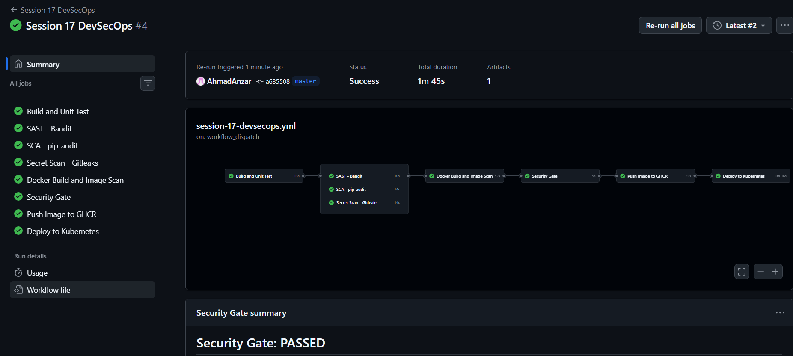
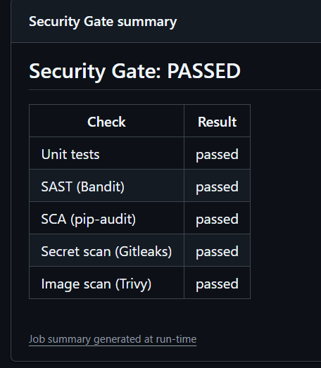
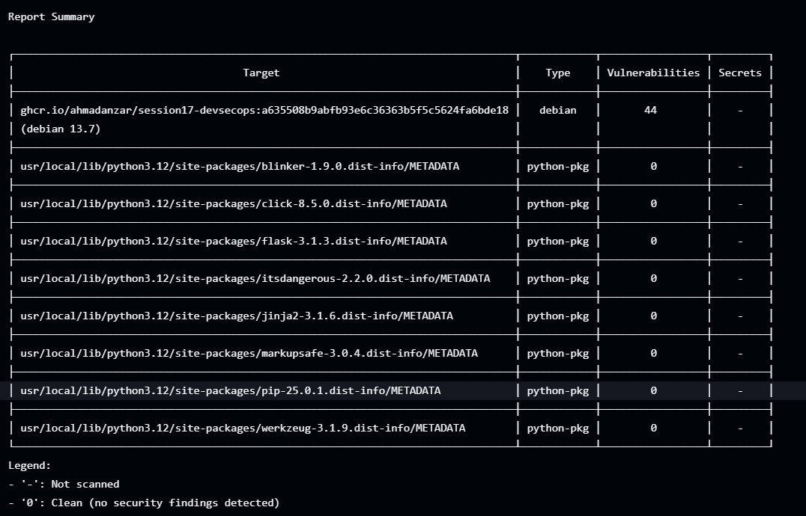
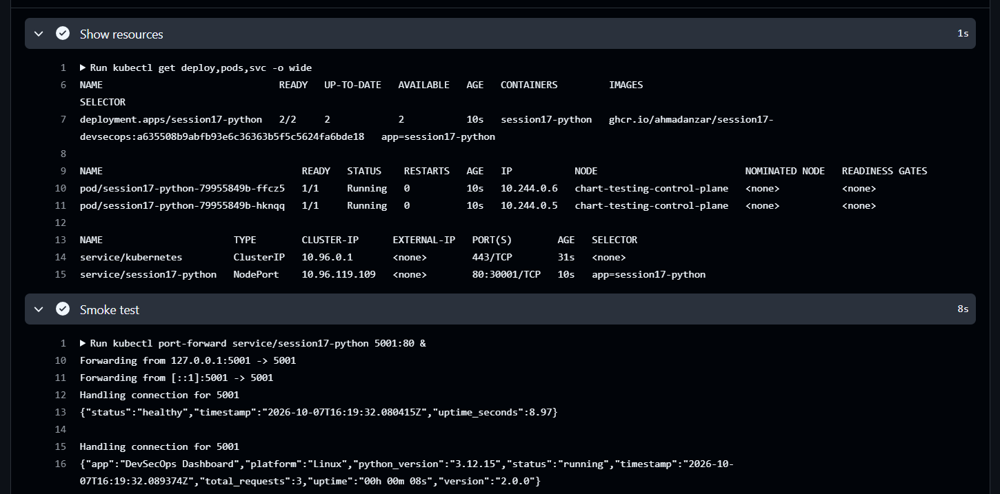
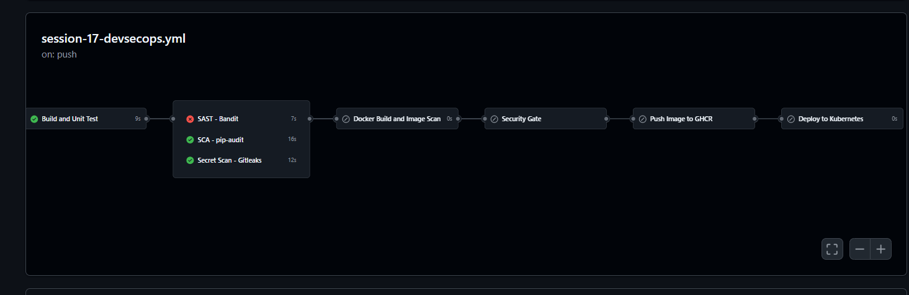

# CI/CD and DevSecOps

Name: Anzar
Enrollment Number: 24BCS10289

For this session I built a full CI/CD pipeline with security checks for a
small Flask app (the "DevSecOps Dashboard" from class). The pipeline tests
the code, runs four kinds of security scans, and only pushes and deploys the
image if all of them pass.

## Project structure

```text
Session-17/
├── app/
│   ├── app.py              Flask app (/health, /api/status, /api/add ...)
│   ├── templates/
│   └── static/
├── tests/test_app.py       8 pytest tests
├── k8s/
│   ├── deployment.yaml     2 replicas, probes on /health, resource limits
│   └── service.yaml
├── Dockerfile              runs as a non-root user
├── .dockerignore
├── requirements.txt        Flask
├── requirements-dev.txt    + pytest, pytest-cov
└── images/

.github/workflows/session-17-devsecops.yml   (at the repo root)
```

Like Session 16, the workflow lives in the repo root and only runs when
something in `Session-17/` changes.

## Pipeline flow

```text
Code (git push)
   │
   ▼
Build + Unit Test
   │
   ├──────────────┬────────────────┐
   ▼              ▼                ▼
 SAST           SCA          Secret Scan        run in parallel
(Bandit)    (pip-audit)      (Gitleaks)
   │              │                │
   └──────────────┴────────────────┘
                  ▼
     Docker Build + Image Scan (Trivy)
                  ▼
            Security Gate
                  ▼
         Push Image (ghcr.io)
                  ▼
       Deploy to Kubernetes (kind)
```

Every job has `needs:` on the one before it, so if any check fails,
everything after it is skipped and nothing gets pushed or deployed.

## What each stage does

| Stage | Tool | What it checks | Fails when |
|---|---|---|---|
| Build + Unit Test | pytest, pytest-cov | compiles the app, runs 8 tests with coverage | any test fails |
| SAST | Bandit | my own Python code for insecure patterns | a medium or high issue is found |
| SCA | pip-audit | the packages in `requirements.txt` against known CVEs | a dependency has a known vulnerability |
| Secret Scan | Gitleaks | API keys, tokens, passwords written in files | any secret is found |
| Image Scan | Trivy | OS packages and Python packages inside the built image | a fixable CRITICAL CVE is found |
| Security Gate | | waits for all of the above | anything above failed |
| Push | docker | pushes the exact image that was scanned to `ghcr.io` | |
| Deploy | kind, kubectl | creates a cluster on the runner, deploys, waits for rollout, curls `/health` | rollout or smoke test fails |

Some details:

- **SAST vs SCA:** SAST looks at code I wrote. SCA looks at code other
  people wrote that I depend on.
- **Trivy:** it prints a full HIGH/CRITICAL report for information, and a
  second step fails the job only on CRITICAL issues that have a fix
  available. Failing on every HIGH with no fix would block every build
  because of base image issues I can't do anything about.
- **Push only what was scanned:** the scan job saves the image as an artifact
  and the push job loads that same image, instead of building it again.
- **Container registry:** GitHub Container Registry. The login uses
  `secrets.GITHUB_TOKEN`, so there's no password stored anywhere.
- **Kubernetes:** the deploy job spins up a temporary kind cluster on the
  GitHub runner. It creates an image pull secret from `GITHUB_TOKEN`
  (the image is private), replaces `__IMAGE_TAG__` in the deployment with the
  commit sha, and checks that the app responds.

## A real issue the pipeline caught

When I first ran Bandit on the app from class, it failed:

```text
>> Issue: [B201:flask_debug_true] A Flask app appears to be run with debug=True,
   which exposes the Werkzeug debugger and allows the execution of arbitrary code.
   Severity: High   Confidence: Medium
   Location: app/app.py:234
```

`debug=True` in production means anyone who can trigger an error page can run
Python code on the server. I changed it so debug mode is only on when
`FLASK_DEBUG=1` is set, which never happens in the container.

Bandit also flagged `host="0.0.0.0"` as medium. That one is on purpose,
because inside a container the app has to listen on all interfaces or nothing
outside can reach it, so I marked it with `# nosec B104` and a comment.

Other hardening I added to the class version:

- the container runs as `appuser` instead of root
- `.dockerignore` keeps tests and k8s files out of the image
- readiness/liveness probes and CPU/memory limits in the Deployment

## Running locally

```bash
pip install -r requirements-dev.txt
pytest -v
python app/app.py          # http://localhost:5001
```

With Docker:

```bash
docker build -t session17 .
docker run --rm -p 5001:5001 session17
```

## Pipeline runs

### Successful run

<!--  -->

### Security gate summary

<!--  -->

### Trivy image scan

<!--  -->

### Deployed to Kubernetes

<!--  -->

### Security gate blocking a bad commit

To see the gate actually block something, I put `debug=True` back and
pushed. Bandit failed, so the image scan, gate, push and deploy were all
skipped. Then I reverted it and the pipeline went green again.

<!--  -->

## Conclusion

The thing that stuck with me is that the security checks found a real
problem in code that was already working and passing all its tests.
Tests check that the app works. The scans check that it's safe to ship.
Putting both in front of the push step means a vulnerable image never reaches
the registry or the cluster.
