# Terraform S3 Demo

Creates an S3 bucket on AWS with Terraform, then destroys it.

## Files

| File | What's in it |
|---|---|
| `provider.tf` | Terraform version, the AWS provider (`~> 6.0`) and the region |
| `variables.tf` | `region`, `bucket_name`, `environment` |
| `terraform.tfvars` | the actual values for those variables |
| `main.tf` | the bucket plus versioning, encryption, public access block and a test file |
| `outputs.tf` | prints the bucket name, ARN, region and versioning status after apply |

Besides the bucket itself I added the settings you'd want on any real
bucket:

- **Versioning** on, so overwritten or deleted files can be recovered
- **Encryption** with AES256 (SSE-S3)
- **Block Public Access** on all four settings
- `force_destroy = true` so `terraform destroy` can delete the bucket even
  with files in it (only for a demo like this)

## AWS access

I made a separate IAM user `terraform-hw` with only `AmazonS3FullAccess`
and `AmazonEC2FullAccess` instead of using the root account, and set it up
with `aws configure`. The keys live in my user profile, not in this folder.

## Workflow

### init, fmt, validate

```bash
terraform init       # downloads the AWS provider into .terraform/
terraform fmt        # formats the .tf files
terraform validate   # checks the syntax and references
```

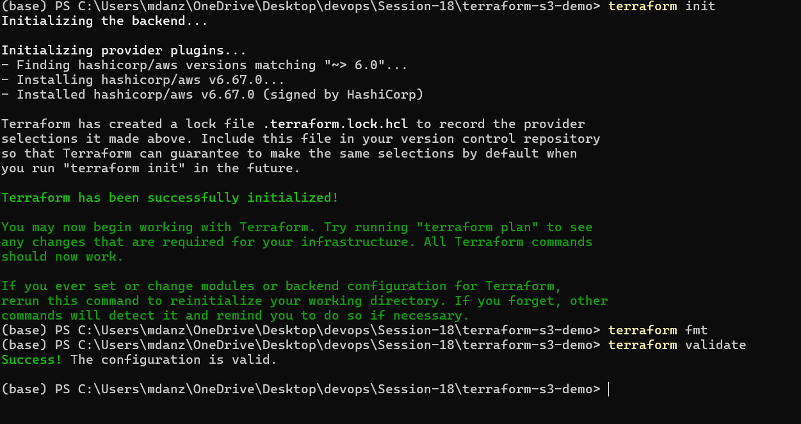

### plan

Shows what Terraform is going to do without changing anything:
`Plan: 5 to add, 0 to change, 0 to destroy.`

```bash
terraform plan
```

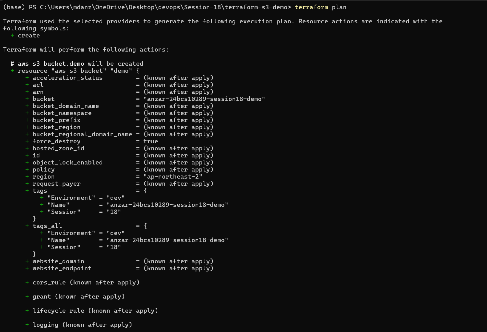

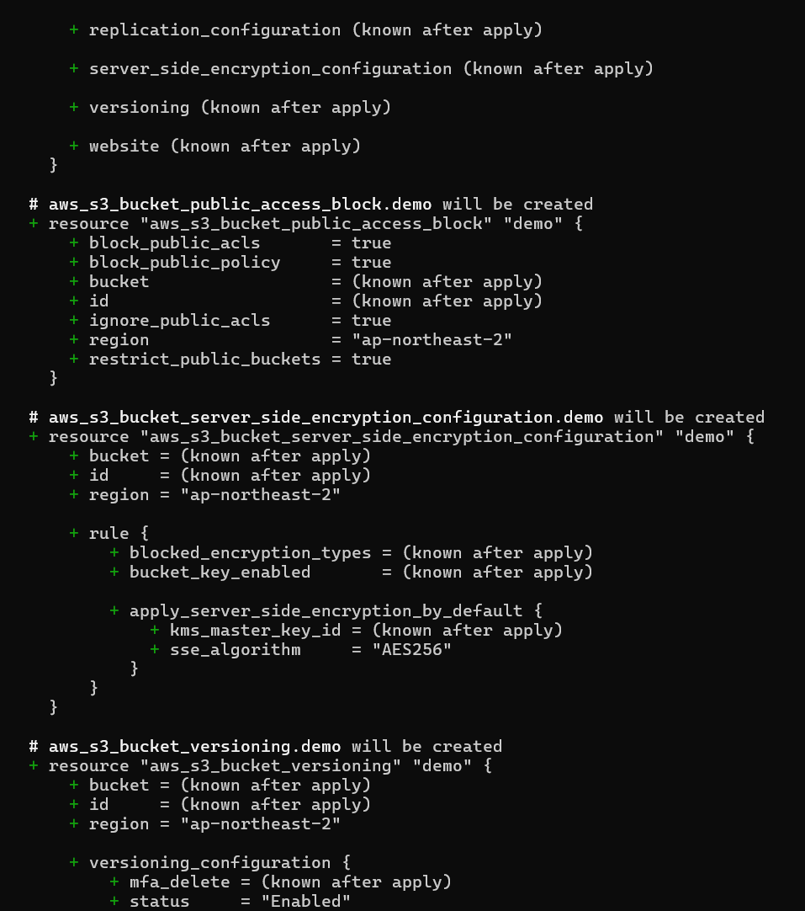

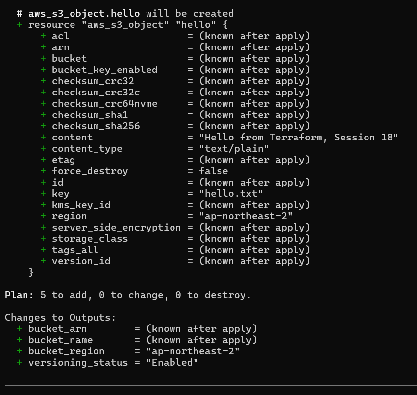

### apply, output, show

```bash
terraform apply -auto-approve
terraform output
terraform show
```

`apply` created the 5 resources, `output` printed the values from
`outputs.tf`, and `show` printed everything Terraform has in its state file.

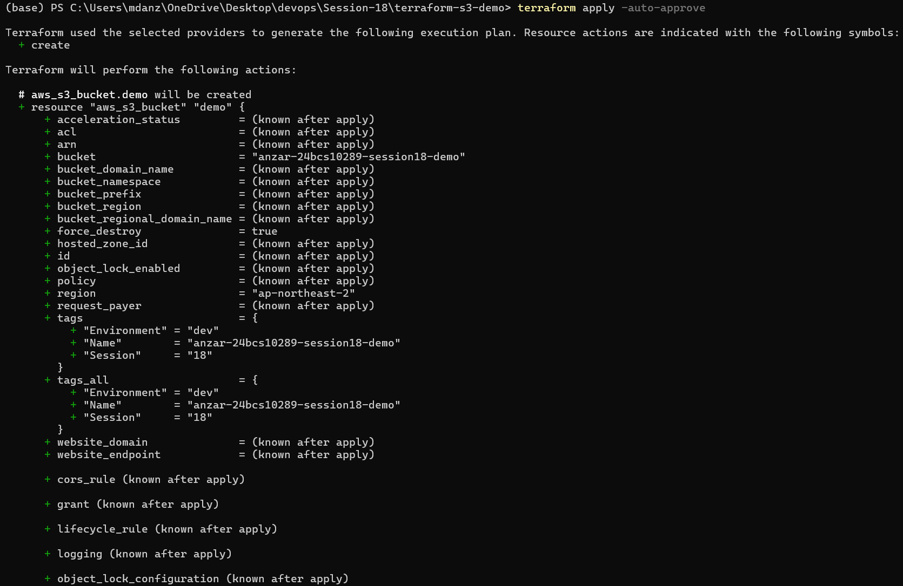

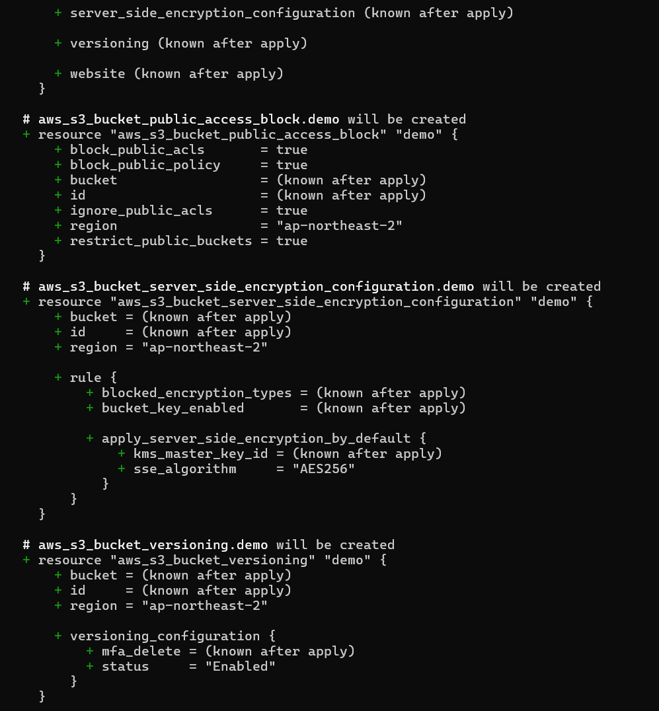

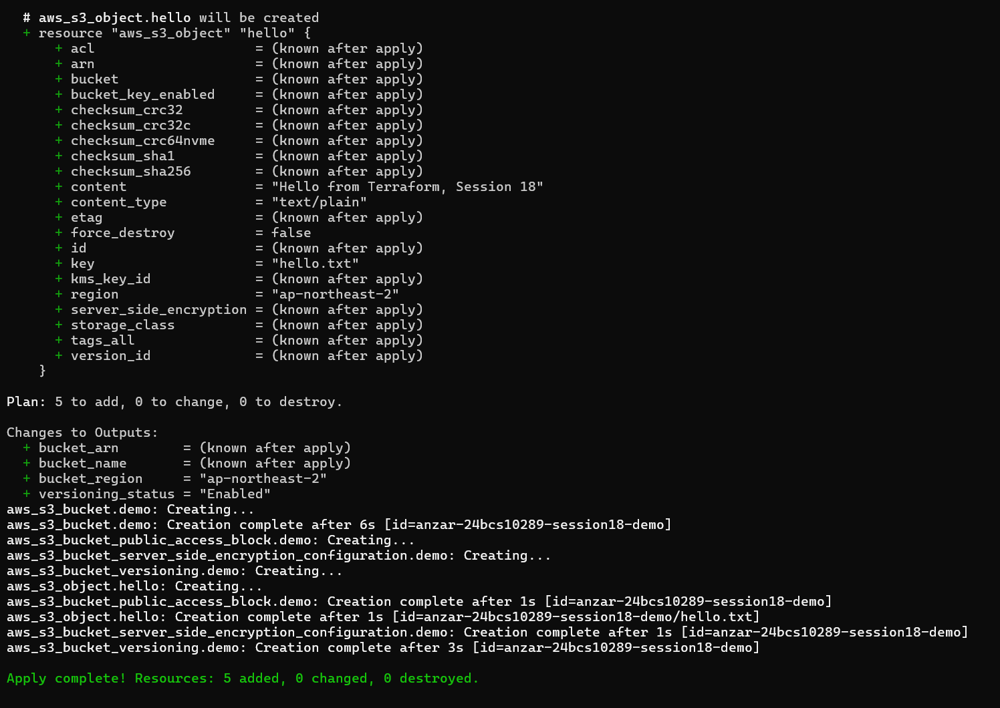

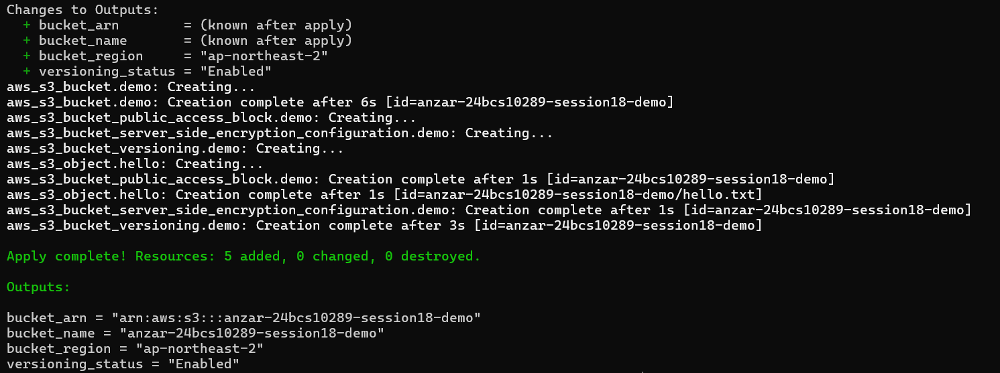

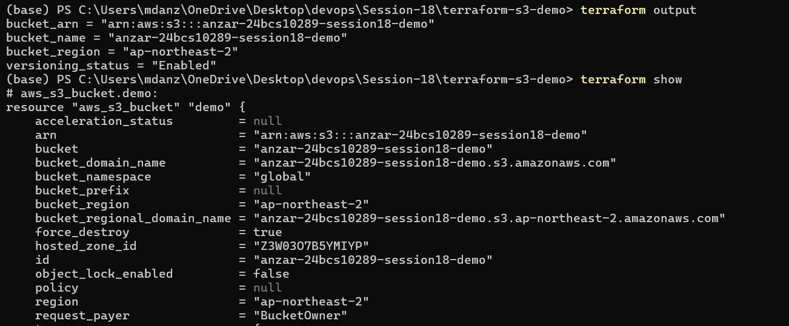

### destroy

```bash
terraform destroy -auto-approve
```

`Destroy complete! Resources: 5 destroyed.`

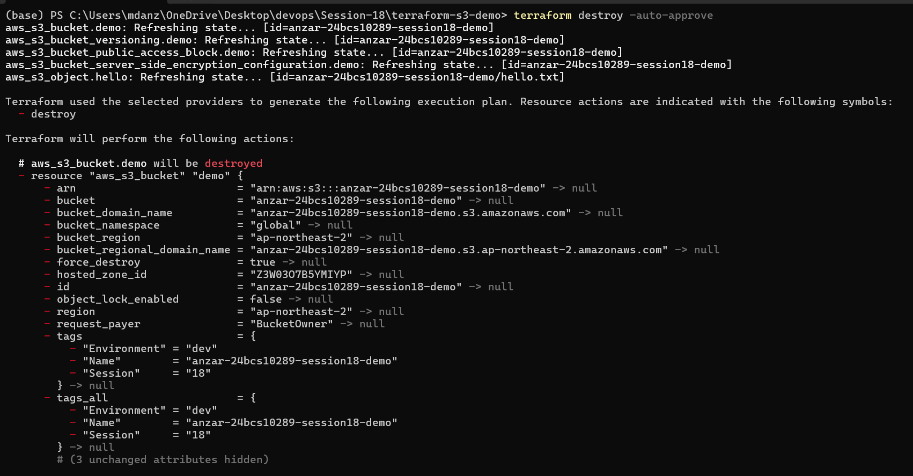

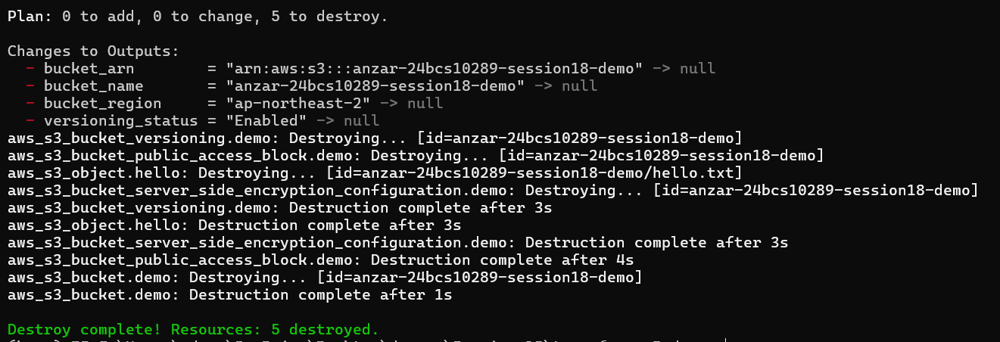

## Problem I hit

My first `apply` failed halfway with
`lookup ...s3-control.ap-northeast-2.amazonaws.com: no such host`. The
bucket got created, but Terraform couldn't finish reading its tags, so it
marked the bucket as **tainted** in the state. That means "this might be
half-built, replace it next time".

The cause was my internet provider's DNS server randomly failing. I changed
Windows to use `8.8.8.8` / `1.1.1.1`, ran `terraform destroy` to clean up the
tainted bucket, and then `apply` worked fine.

The state file and `.terraform/` are in `.gitignore`, since the state can
contain sensitive values and shouldn't go into git.
