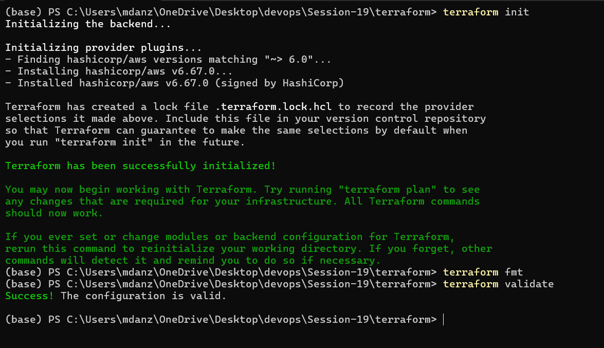
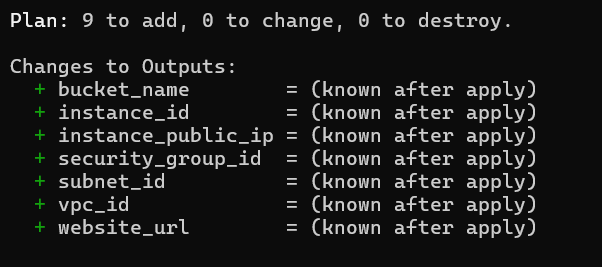
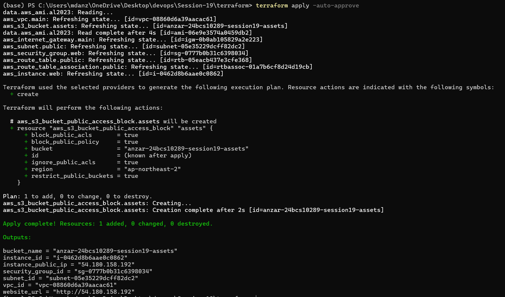
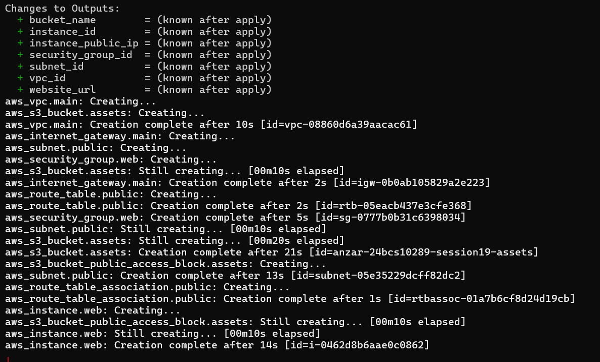
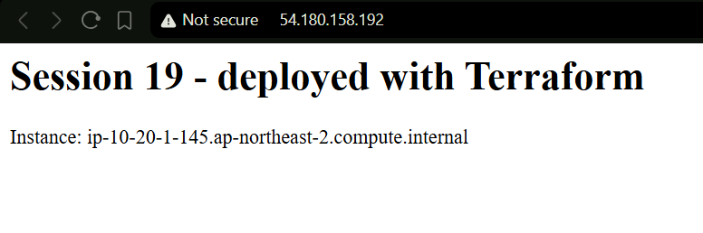
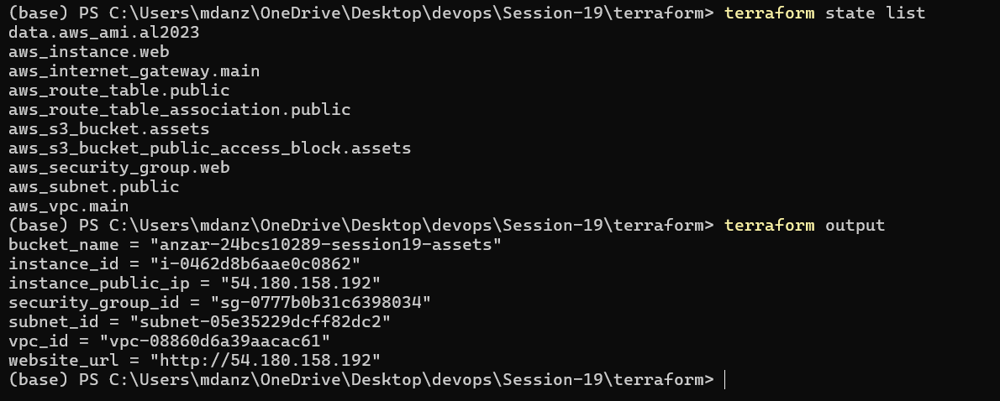
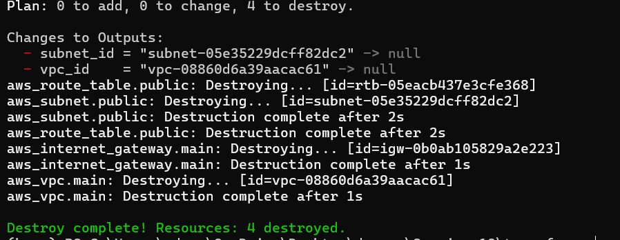

# Cloud and Terraform in Action

Name: Anzar
Enrollment Number: 24BCS10289

An end-to-end AWS setup built with Terraform: a VPC with a public subnet,
a security group, an EC2 instance running nginx, and an S3 bucket.
Everything was created with `terraform apply` and removed with
`terraform destroy`.

## Architecture

```text
                     Internet
                        │
                        ▼
              ┌───────────────────┐
              │ Internet Gateway  │
              └─────────┬─────────┘
┌───────────────────────┼─────────────────────────────┐
│ VPC 10.20.0.0/16      │                             │
│                       ▼                             │
│   Route table: 0.0.0.0/0 -> Internet Gateway        │
│                       │                             │
│  ┌────────────────────┼──────────────────────────┐  │
│  │ Public subnet 10.20.1.0/24 (ap-northeast-2a)  │  │
│  │                    ▼                          │  │
│  │   ┌──────────────────────────────────┐        │  │
│  │   │ Security group: allow TCP 80 in  │        │  │
│  │   │  ┌────────────────────────────┐  │        │  │
│  │   │  │ EC2 t3.micro               │  │        │  │
│  │   │  │ Amazon Linux 2023 + nginx  │  │        │  │
│  │   │  └────────────────────────────┘  │        │  │
│  │   └──────────────────────────────────┘        │  │
│  └───────────────────────────────────────────────┘  │
└─────────────────────────────────────────────────────┘

  S3 bucket: anzar-24bcs10289-session19-assets (private, regional, outside the VPC)
```

## Files

```text
terraform/
├── versions.tf        Terraform + AWS provider, default tags for every resource
├── variables.tf       region, CIDRs, instance type, bucket name
├── terraform.tfvars   my values
├── main.tf            all the resources
└── outputs.tf         ids, public IP, website URL, bucket name
```

## What the project shows

**Providers:** `versions.tf` pins `hashicorp/aws ~> 6.0` and sets the
region. `default_tags` adds `Project = session19` and `ManagedBy = Terraform`
to every resource, so they're easy to find in the console.

**Variables:** the region, the VPC and subnet CIDRs, the instance type and
the bucket name all come from `variables.tf` / `terraform.tfvars`, so
nothing is hardcoded in `main.tf`.

**Resources (9):** VPC, subnet, internet gateway, route table, route table
association, security group, EC2 instance, S3 bucket, bucket public access
block. Plus one data source, `aws_ami`, which looks up the latest Amazon
Linux 2023 image so I don't have to hardcode an AMI id.

**Outputs:** after apply, Terraform prints the VPC/subnet/SG/instance ids,
the public IP, a ready-to-click `website_url`, and the bucket name.

**Dependencies:**

- *Implicit:* most of the order comes from references. The subnet uses
  `aws_vpc.main.id`, so Terraform creates the VPC first. The EC2 instance
  references the subnet and security group, so it waits for both.
- *Explicit:* the instance also has
  `depends_on = [aws_route_table_association.public]`. The instance doesn't
  reference the route table anywhere, but `user_data` runs `dnf install nginx`
  on boot, which needs internet. Without this, the instance could boot before
  the route to the internet gateway exists and the install would fail.

You can see this in the apply output: VPC first, then subnet / IGW / SG,
then the route table, the association, and the EC2 instance last. Destroy
goes in exactly the reverse order.

**State:** Terraform saves what it created in `terraform.tfstate`.
`terraform state list` shows every resource it's tracking. That's how
`plan` knows what already exists and what would change. The state file is
in `.gitignore` because it can contain sensitive data.

## Commands and screenshots

### init, fmt, validate

```bash
terraform init
terraform fmt
terraform validate
```



### plan

`Plan: 9 to add, 0 to change, 0 to destroy.`

```bash
terraform plan
```



### apply

```bash
terraform apply -auto-approve
```





The first apply created 8 of the 9 resources and then failed on the
bucket's public access block with `lookup ...s3.ap-northeast-2.amazonaws.com:
no such host`. The bucket had only existed for a few seconds and its DNS
name wasn't resolvable yet. On top of that, my internet provider's DNS was
already unreliable that day. I ran `terraform apply` again, and because the
other 8 were already in the state, it only created the missing one.

### The website

The EC2 instance installed nginx through `user_data` on its first boot.



### state and output

```bash
terraform state list
terraform output
```



### destroy

```bash
terraform destroy -auto-approve
```

`Destroy complete! Resources: 9 destroyed.` After this I checked in the AWS
CLI that no instance or VPC with the `session19` tag was left.



## What I learned

Writing the infrastructure as code made it repeatable. I created and
deleted the whole thing more than once without clicking anything in the
console. The dependency part was the most interesting: Terraform works out
most of the order by itself from the references, and `depends_on` is only
needed when there's a hidden dependency like `user_data` needing internet.
