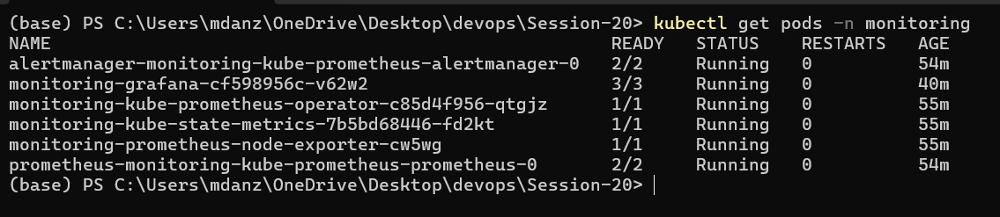
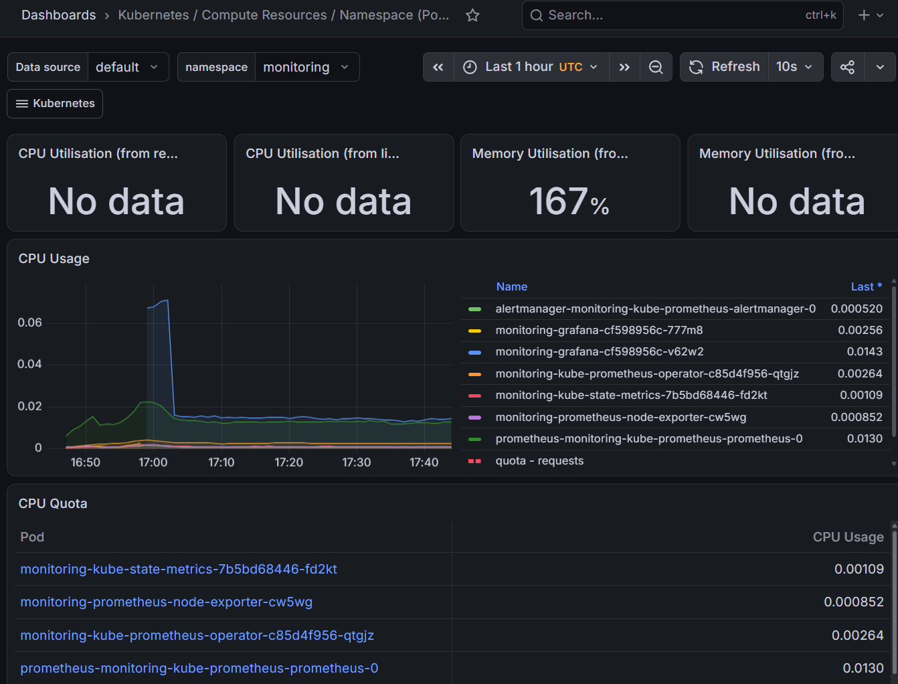
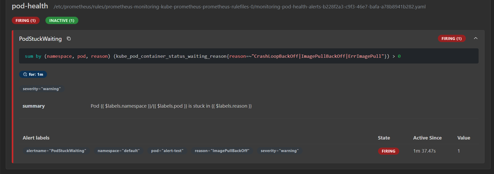
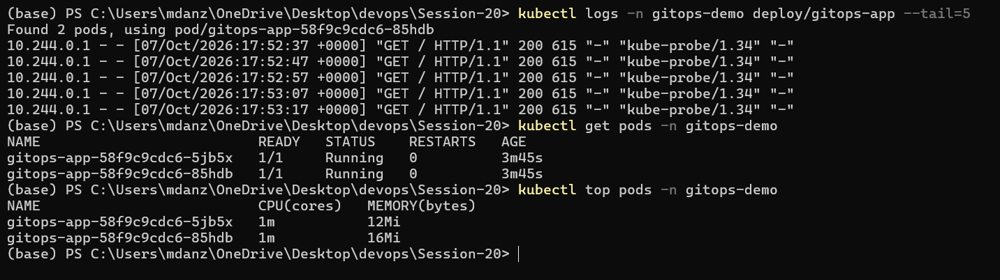
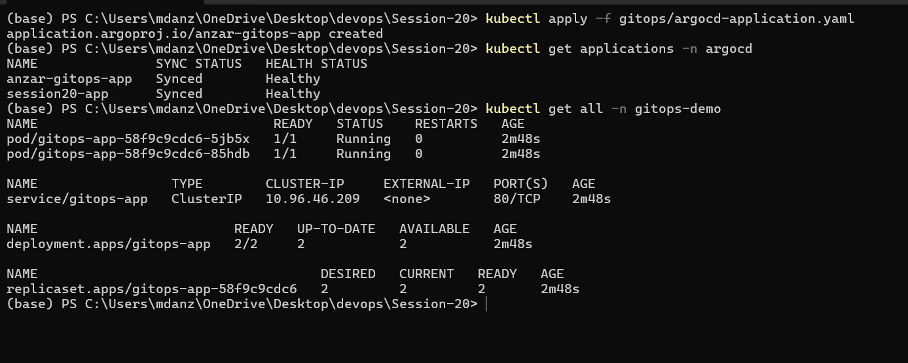
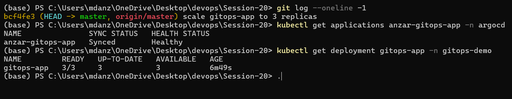
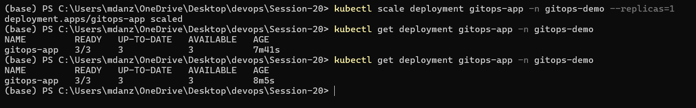

# Monitoring, Observability and GitOps

Name: Anzar
Enrollment Number: 24BCS10289

Everything here runs on my local kind cluster.

```text
Session-20/
├── monitoring/
│   ├── values.yaml           settings for kube-prometheus-stack
│   ├── alert-rule.yaml       my own alert rules
│   └── broken-pod.yaml       pod used to trigger an alert
├── gitops/
│   ├── app/                  what Argo CD syncs from git
│   │   ├── namespace.yaml
│   │   ├── deployment.yaml
│   │   └── service.yaml
│   └── argocd-application.yaml
├── observability.md          Task 2 notes
└── images/
```

---

## Task 1: Monitoring

I installed `kube-prometheus-stack` with Helm. It comes with Prometheus
(collects metrics), Alertmanager (alerts), Grafana (dashboards),
node-exporter (node CPU/memory) and kube-state-metrics (pod and deployment
status).

```bash
helm repo add prometheus-community https://prometheus-community.github.io/helm-charts
helm repo update
helm install monitoring prometheus-community/kube-prometheus-stack -n monitoring --create-namespace -f monitoring/values.yaml
kubectl get pods -n monitoring
```

A few settings in `values.yaml` are there because of kind: node-exporter
can't mount the host's root filesystem on Docker Desktop, and etcd,
scheduler, controller-manager and kube-proxy metrics aren't reachable, so
I turned those off. Otherwise they'd just show up as false alerts.

<!--  -->

### Metrics, CPU and memory

Opened Grafana with a port-forward (login `admin` / `admin123`, local only):

```bash
kubectl port-forward -n monitoring svc/monitoring-grafana 3000:80
```

The **Kubernetes / Compute Resources / Namespace (Pods)** dashboard shows
CPU and memory per pod. The same numbers are in the terminal:

```bash
kubectl top nodes
kubectl top pods -A
```

<!--  -->

### Alerts

`alert-rule.yaml` adds two rules:

| Alert | Fires when |
|---|---|
| `PodStuckWaiting` | a container is in CrashLoopBackOff, ImagePullBackOff or ErrImagePull for 1 minute |
| `HighPodCPU` | a pod uses more than half a CPU core for 2 minutes |

The `release: monitoring` label is needed, otherwise Prometheus ignores the
rule.

To test it, I deployed a pod with an image tag that doesn't exist:

```bash
kubectl apply -f monitoring/alert-rule.yaml
kubectl apply -f monitoring/broken-pod.yaml
kubectl port-forward -n monitoring svc/monitoring-kube-prometheus-prometheus 9090:9090
```

On `http://localhost:9090/alerts` the alert went from Pending to
**Firing** after about a minute.

<!--  -->

### Logs and application health

```bash
kubectl logs -n gitops-demo deploy/gitops-app --tail=5
kubectl get pods -n gitops-demo
```

The app's readiness probe hits `/`, so a pod only gets traffic once nginx
actually answers. In Prometheus, the `up` metric shows whether every target
is reachable (1 means healthy, 0 means down).

<!--  -->

---

## Task 2: Observability

Written up in [observability.md](observability.md): what metrics, logs and
traces are, why observability matters, common tools, and what to look at
in Kubernetes.

---

## Task 3: GitOps

### What GitOps is

- **Git is the source of truth.** The YAML in git is what the cluster
  should look like. Nobody runs `kubectl apply` by hand.
- **Declarative.** I describe the end state (2 replicas of nginx), not the
  steps to get there.
- **Continuous reconciliation.** Argo CD keeps comparing git with the
  cluster. If they differ, it changes the cluster to match git.
- **Workflow:** change YAML → commit → push → Argo CD notices → cluster
  updated. Rolling back is just `git revert`.

```text
  me ── git push ──> GitHub repo (Session-20/gitops/app)
                          │
                          │  Argo CD checks every ~3 min
                          ▼
                       Argo CD ── applies changes ──> Kubernetes
```

### Demo

Argo CD was already installed on the cluster. `argocd-application.yaml`
points it at **this** repo, path `Session-20/gitops/app`, branch `master`,
with automated sync, `prune` and `selfHeal` turned on.

```bash
kubectl apply -f gitops/argocd-application.yaml
kubectl get applications -n argocd
kubectl get all -n gitops-demo
```

The app showed `Synced` and `Healthy` with 2 pods, and I never applied the
deployment myself.

<!--  -->

Then I changed `replicas: 2` to `replicas: 3` in `gitops/app/deployment.yaml`,
committed and pushed. Argo CD picked it up and the deployment went to 3/3.

<!--  -->

**Self-heal:** I also tried scaling it by hand with
`kubectl scale deployment gitops-app -n gitops-demo --replicas=1`. Argo CD
put it straight back to 3, because git says 3.

<!--  -->

---

## Cleanup

```bash
kubectl delete -f monitoring/broken-pod.yaml
kubectl delete -f gitops/argocd-application.yaml
helm uninstall monitoring -n monitoring
```
