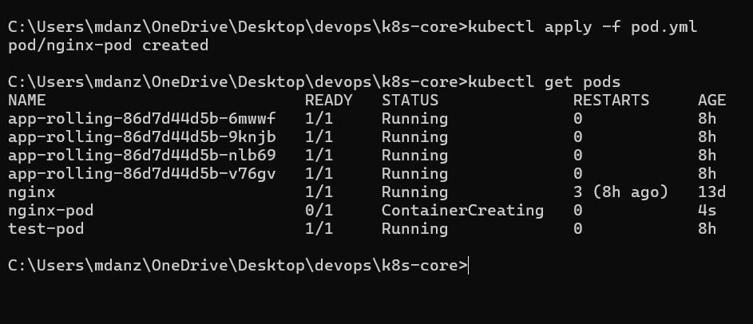
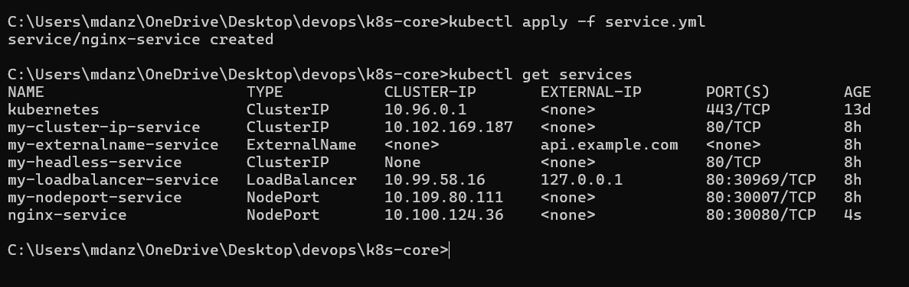

### pod.yml

### hello.yml

### deployment.yml

### replicaset.yml

    

### service.yml

### get all

## Notes
**What is a DaemonSet and where is it used?**
A DaemonSet makes sure a copy of a Pod runs on every node, or selected nodes, in the cluster. It is commonly used for logging, monitoring, and node-level services.

**What is a Deployment?**
A Deployment manages and updates a set of Pods, making sure the desired number of replicas are running. It is commonly used for stateless applications.

**What is a ReplicaSet?**
A ReplicaSet ensures that a specified number of identical Pods are always running. Deployments usually manage ReplicaSets rather than creating them directly.

**What is a StatefulSet and where do we use it?**
A StatefulSet manages applications that need stable identities, storage, and predictable Pod ordering. It is commonly used for databases and other stateful applications.

**What are the differences between these objects?**
A Deployment manages stateless applications and handles updates, a ReplicaSet maintains the number of Pod replicas, a DaemonSet runs Pods across nodes, and a StatefulSet manages Pods that need stable identity and persistent storage.
