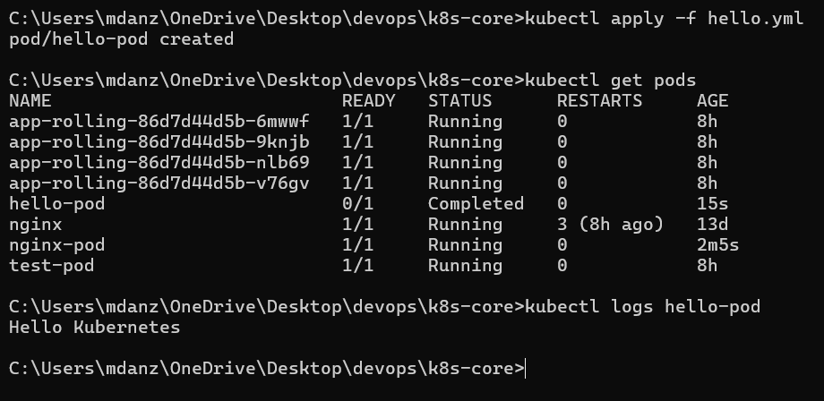
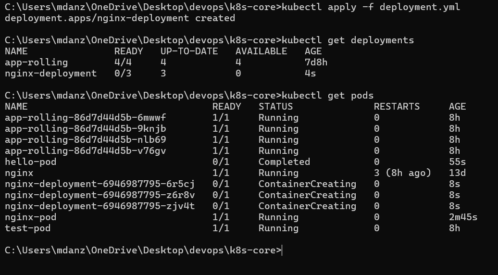
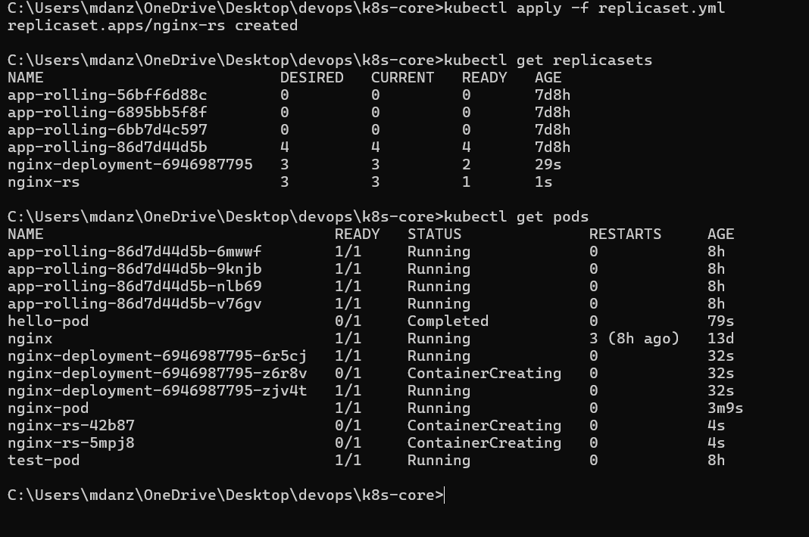
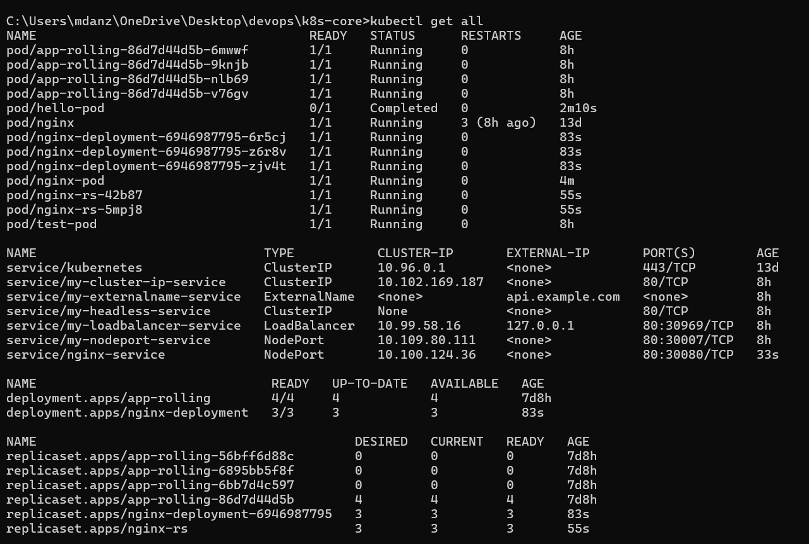

### Muhammad Anzar Ahmad (24bcs10289)

## Kubernetes Core Objects

### 1. Pod YAML


### 2. Short-lived Pod



### 3. Deployment YAML


### 4. ReplicaSet YAML

    

### 5. Service YAML


### 6. View Kubernetes Objects




## Notes

## Pod

A Pod is the smallest unit that Kubernetes schedules and runs. It holds one or more containers that share the same network space and can share storage volumes.

Most Pods contain one main application container. Extra containers can also be placed in the same Pod when they need to work closely with the main container. These are often called helper or sidecar containers.

A Pod gets its own IP address, but that address is temporary. If the Pod is deleted or replaced, the next Pod can receive a different IP address. Applications usually use a Service instead of depending on a Pod IP.

A Pod manifest normally includes these important parts:

| Part | Purpose |
| --- | --- |
| `apiVersion` | Tells Kubernetes which API version is being used |
| `kind` | Tells Kubernetes that the object is a Pod |
| `metadata` | Stores the name and labels |
| `spec` | Describes the containers and their settings |

## Pod Lifecycle

The Pod status changes as Kubernetes schedules the Pod, starts its containers, and checks their health. The status shown by `kubectl get pods` is useful for a quick check, but more information is available through `kubectl describe pod` and Pod events.

| Status | Meaning |
| --- | --- |
| Pending | The Pod has not started yet, often because it is waiting for a node or image |
| ContainerCreating | Kubernetes is preparing the container, network, or volumes |
| Running | At least one container is running |
| Succeeded | The containers finished successfully |
| Failed | A container ended with an error and did not complete successfully |
| CrashLoopBackOff | A container keeps failing and Kubernetes is waiting before restarting it |
| ImagePullBackOff | Kubernetes cannot download the requested image and is retrying |

The `hello.yml` example represents a short-lived Pod. It starts a command, finishes its work, and reaches the `Completed` display status. A normal web application usually stays in the `Running` state instead.

## ReplicaSet

A ReplicaSet keeps a chosen number of matching Pods running. If the required count is three and one Pod is deleted, the ReplicaSet creates another Pod to bring the count back to three.

Labels are important because the ReplicaSet uses its selector to identify the Pods that belong to it. The selector and the labels in the Pod template must match. A wrong label can cause the controller to manage the wrong Pods or fail to manage the expected ones.

ReplicaSets are useful for maintaining copies of an application, but they are not normally used directly for application updates. A Deployment creates and manages ReplicaSets so that version changes and rollbacks are easier to handle.

## Deployment

A Deployment is the usual controller for a stateless application such as a web server or API. It describes the desired Pod template and the number of replicas required.

The Deployment creates a ReplicaSet, and the ReplicaSet creates the Pods. This gives the application a repair process when a Pod fails. It also allows Kubernetes to replace old Pods with new ones during an update.

Common Deployment features include:

- Keeping the requested number of replicas available
- Replacing failed Pods
- Updating the application image
- Performing a rolling update
- Keeping rollout history
- Returning to an earlier version with a rollback

A Deployment works well when the replicas are interchangeable. It is not the best choice when each copy needs its own fixed name or its own permanent storage.

## StatefulSet

A StatefulSet is used when each Pod needs a stable identity. The Pods usually receive ordered names such as `database-0`, `database-1`, and `database-2`.

Unlike a normal Deployment, a StatefulSet keeps the identity of a Pod when it is recreated. It can also create a separate persistent volume claim for each replica. This makes it suitable for databases, message systems, and clustered applications that need to know which member they are talking to.

StatefulSets often work with a Headless Service. The Service gives the Pods stable DNS names, while the StatefulSet controls their order and storage. Stateful applications still need their own data replication and backup plan. A StatefulSet does not replace those features.

## DaemonSet

A DaemonSet places one copy of a Pod on every eligible node. When a new node joins the cluster, the DaemonSet can place a new copy there automatically. When a node is removed, its DaemonSet Pod goes away with it.

DaemonSets are mainly used for node-level work, such as:

- Collecting logs from each node
- Monitoring node health
- Running security agents
- Providing storage or network support

A DaemonSet does not usually use a fixed replica count. The number of Pods depends on how many nodes match its rules. Taints, tolerations, and node selectors can limit where those Pods run.

## Service

A Service gives a stable way to reach a group of Pods. It uses labels and selectors to find the correct Pods, then sends traffic to the available endpoints. This is more reliable than connecting directly to a temporary Pod IP.

The `service.yml` file shows how a Service can provide a fixed name and port for an application. The Service type decides whether it is available only inside the cluster or also from outside the cluster.

## How These Objects Work Together

The objects are normally connected in this order:

```text
Deployment to ReplicaSet to Pods to Service
```

The Deployment describes the application version and replica count. The ReplicaSet keeps the required number of Pods alive. The Pods run the containers. The Service gives other applications a steady way to reach those Pods.

StatefulSets and DaemonSets are used instead of Deployments when the application needs stable identity or node-level placement.

## Quick Comparison

| Object | Main job | Typical use |
| --- | --- | --- |
| Pod | Runs one or more containers | Small test or application unit |
| ReplicaSet | Keeps a number of matching Pods running | Replica maintenance |
| Deployment | Manages stateless Pods and updates | Web apps and APIs |
| StatefulSet | Keeps stable Pod names and storage | Databases and clustered apps |
| DaemonSet | Runs a Pod on selected nodes | Logging and monitoring agents |
| Service | Provides a stable network address | Accessing application Pods |

## Troubleshooting Guide

When a Pod is not working, check its status first. `kubectl describe pod <pod-name>` shows scheduling messages and container events. An `ImagePullBackOff` status usually points to an image name or registry problem. A `CrashLoopBackOff` status usually means the application starts and then exits or fails repeatedly.

For a Deployment or ReplicaSet, check the labels and selectors if the expected Pods are not being managed. Also check that the requested image, container command, and replica count are correct.
