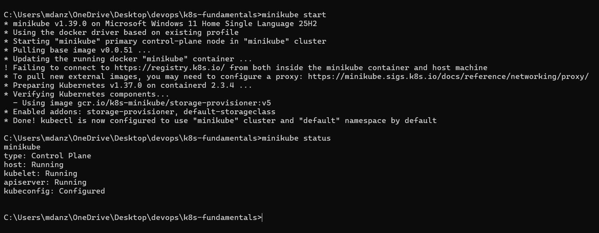

### Muhammad Anzar Ahmad (24bcs10289)

### basic minikube commands

## Notes
### What is minikube
Minikube is a tool that lets you run a small Kubernetes cluster locally on your computer. It is mainly used for learning, development, and testing Kubernetes applications.

### What is kubernetes
Kubernetes is an open-source platform used to deploy, manage, and scale containerized applications. It automatically handles things like running containers, restarting failed Pods, and managing application replicas.