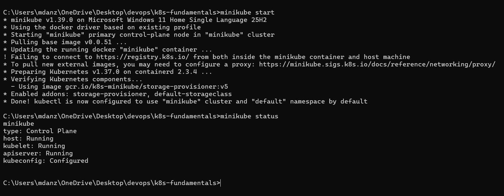

# Kubernetes Fundamentals

Name: Anzar
Enrollment Number: 24BCS10289

## Minikube setup

Minikube runs a small Kubernetes cluster on a local computer. It is useful
for learning and testing Kubernetes without using a cloud cluster.

```bash
minikube start
minikube status
kubectl cluster-info
kubectl get nodes -o wide
```



`minikube start` creates and starts the local cluster. `minikube status`
shows whether the cluster is running. `kubectl cluster-info` displays the
main Kubernetes services, and `kubectl get nodes` shows the available cluster
nodes.

## What is Kubernetes?

Kubernetes is a platform for running and managing containers. It can restart
failed containers, keep the required number of application copies running,
and help applications communicate with each other.

## Kubernetes architecture

A Kubernetes cluster has a control plane and one or more worker nodes.

The control plane receives commands and makes decisions about the cluster.
The API server is the main entry point for `kubectl` commands. The scheduler
chooses a worker node for new Pods. The controller manager keeps the actual
cluster state close to the desired state. `etcd` stores the cluster
configuration and state.

Worker nodes run the application Pods. The kubelet communicates with the
control plane and makes sure the containers in each Pod are running. The
container runtime runs the containers. The network component helps Pods and
Services communicate.

```text
kubectl
   |
   v
API Server
   |
   +-- Scheduler
   +-- Controller Manager
   +-- etcd
   |
   v
Worker Node
   +-- Kubelet
   +-- Container Runtime
   +-- Pods
```

## Basic Kubernetes objects

### Pod

A Pod is the smallest unit that Kubernetes runs. It usually contains one
application container. A Pod can be replaced, so applications normally use a
Service instead of relying on a Pod IP address.

### Deployment

A Deployment describes the desired state of a stateless application. It
controls the number of replicas and can update the application gradually.

### ReplicaSet

A ReplicaSet keeps the requested number of matching Pods running. If a Pod
stops, the ReplicaSet creates another one.

### Service

A Service gives a stable name and network address to a group of Pods. It
allows other applications to reach Pods even when their individual IP
addresses change.

### Namespace

A Namespace separates resources inside the same Kubernetes cluster. It helps
organize applications and avoid naming conflicts.

## Basic commands

```bash
kubectl get nodes
kubectl get pods
kubectl get pods --all-namespaces
kubectl get deployments
kubectl get services
kubectl get namespaces
kubectl describe node
kubectl describe pod POD_NAME
kubectl get events
```

`kubectl get` gives a quick list of resources. `kubectl describe` shows
more details, events, and troubleshooting information.

## Basic hands-on Pod exercise

Create a file named `hello-pod.yml`:

```yaml
apiVersion: v1
kind: Pod
metadata:
  name: hello-pod
  labels:
    app: hello
spec:
  containers:
    - name: nginx
      image: nginx:alpine
      ports:
        - containerPort: 80
```

Apply and inspect the Pod:

```bash
kubectl apply -f hello-pod.yml
kubectl get pods
kubectl describe pod hello-pod
kubectl get pod hello-pod -o wide
kubectl delete pod hello-pod
```

The Pod should move to the `Running` state after its image is downloaded.
`kubectl describe` shows the Pod configuration, container details, and
events.

## Kubernetes Basics tutorial commands

These commands cover the basic workflow of deploying and exposing an
application:

```bash
kubectl create deployment hello-minikube --image=nginx:alpine
kubectl get deployments
kubectl get pods
kubectl expose deployment hello-minikube --type=NodePort --port=80
kubectl get services
minikube service hello-minikube --url
kubectl scale deployment hello-minikube --replicas=2
kubectl get pods
kubectl delete service hello-minikube
kubectl delete deployment hello-minikube
```

The Deployment creates the Pods, and the Service provides a stable way to
reach them. Scaling changes the number of running Pod copies.

## Pod lifecycle

A Pod commonly moves through these states:

- `Pending`: Kubernetes has accepted the Pod, but it is not running yet.
- `Running`: The container is running.
- `Succeeded`: The container finished successfully.
- `Failed`: The container stopped because of an error.
- `Unknown`: Kubernetes cannot determine the current state.

The following commands help inspect the lifecycle:

```bash
kubectl get pods -w
kubectl describe pod POD_NAME
kubectl get events --sort-by=.metadata.creationTimestamp
```

## Cleanup

```bash
minikube stop
```

The cluster can be started again later with:

```bash
minikube start
```

## Conclusion

In this session, I learned how to start a local Kubernetes cluster with
Minikube, check its status, and use basic `kubectl` commands. I also learned
about Kubernetes architecture, Pods, Deployments, ReplicaSets, Services,
Namespaces, and the basic Pod lifecycle.
