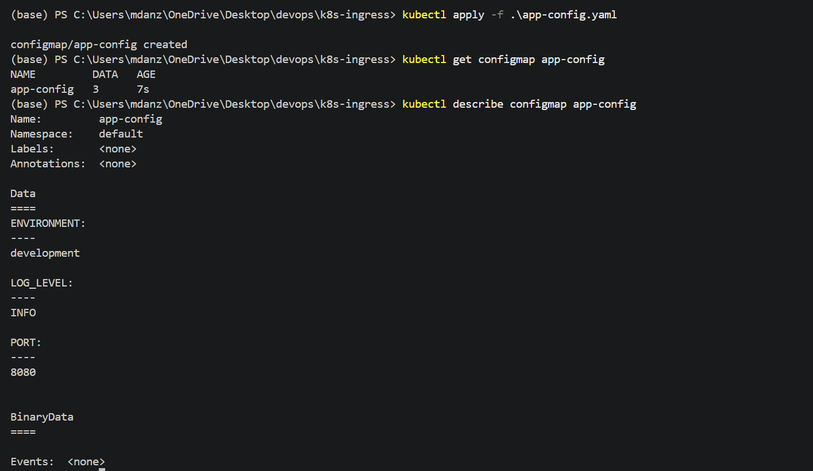
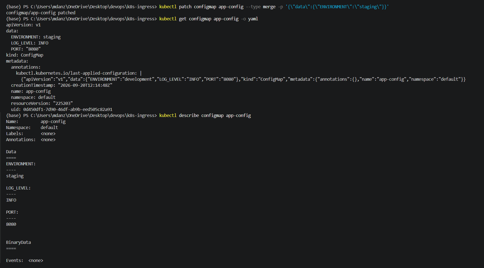
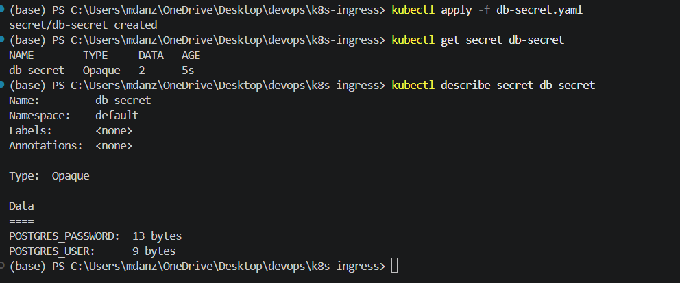
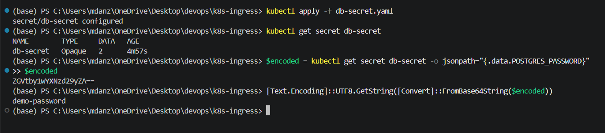
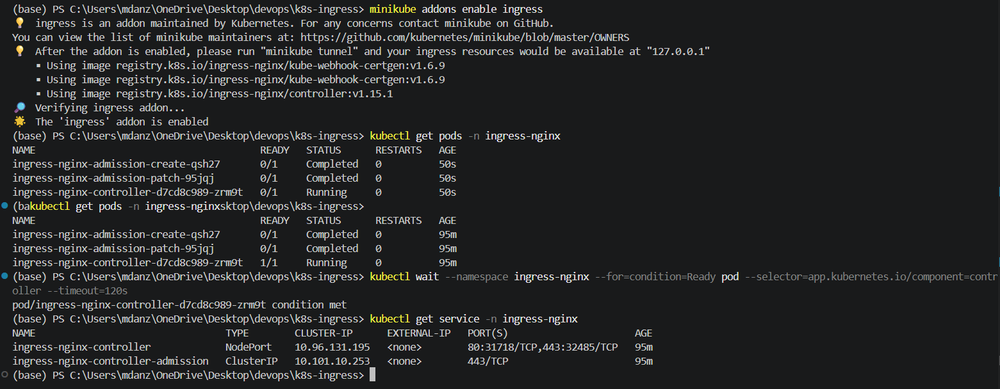
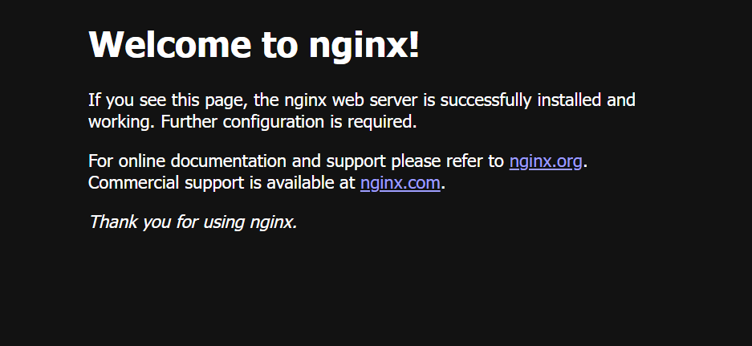
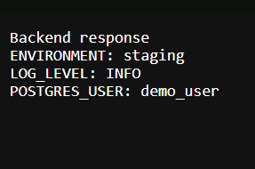
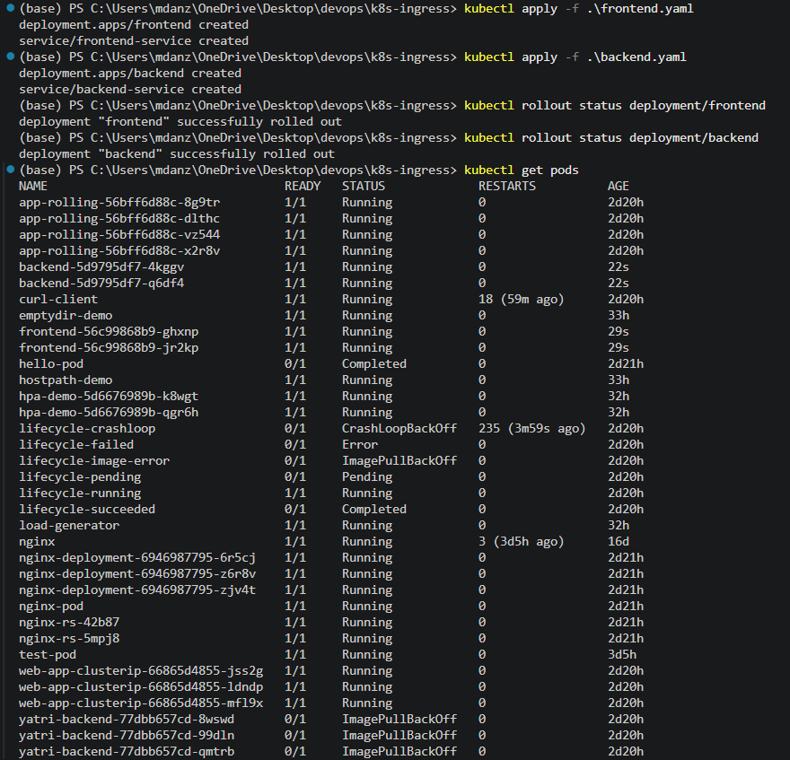
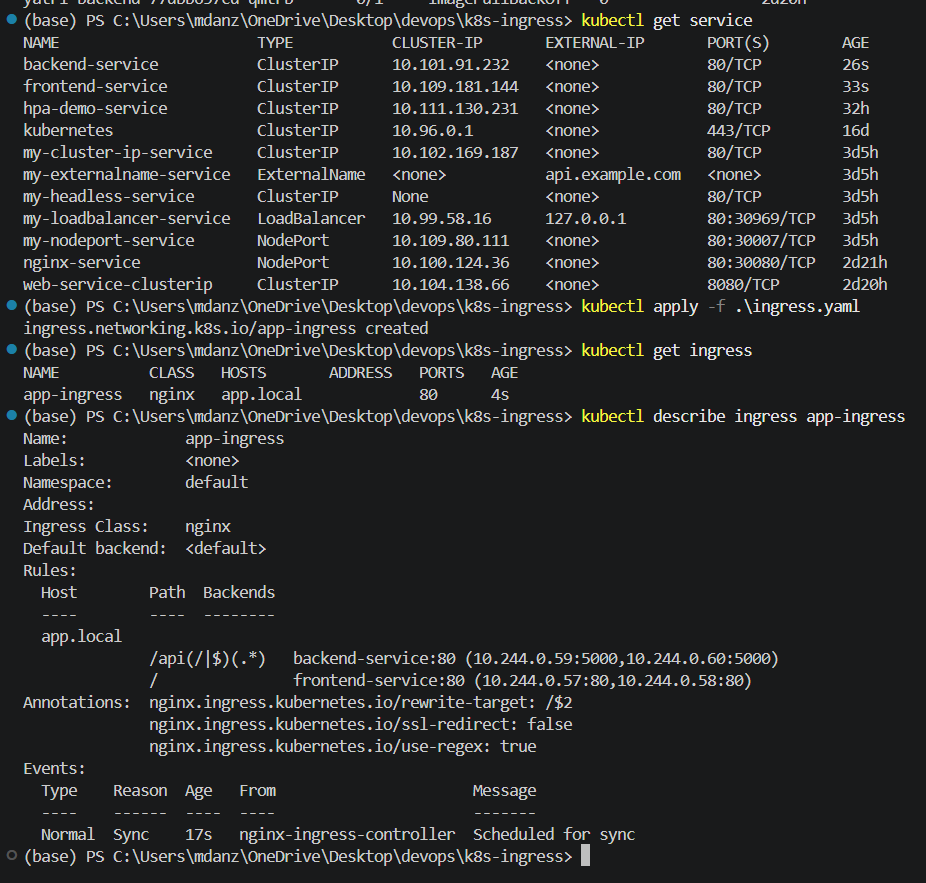

### Muhammad Anzar Ahmad (24bcs10289)

# Kubernetes Ingress, ConfigMaps and Secrets

This topic explains how to keep application settings outside the container image, how to store sensitive values separately, and how to send web traffic to different Kubernetes Services.

## 1. ConfigMap

A ConfigMap stores normal application settings. It can contain values such as the environment name, log level, port number, or a feature setting.

ConfigMaps are useful because the application image does not need to change every time a normal setting changes.

```yaml
apiVersion: v1
kind: ConfigMap
metadata:
  name: app-config
data:
  ENVIRONMENT: development
  LOG_LEVEL: INFO
  PORT: "8080"
```

Create and inspect the ConfigMap:

```bash
kubectl apply -f app-config.yaml
kubectl get configmap app-config
kubectl describe configmap app-config
```



ConfigMaps are not meant for passwords, tokens, private keys, or other sensitive data.

## 2. Updating a ConfigMap

When ConfigMap values are loaded as environment variables, a running container does not automatically receive the new value. The Pod normally needs to be replaced or restarted.

```bash
kubectl patch configmap app-config --type merge -p '{"data":{"ENVIRONMENT":"staging"}}'
kubectl rollout restart deployment backend
kubectl rollout status deployment backend
```

ConfigMaps mounted as files can be updated by Kubernetes after a short delay. The application still needs to read the file again. A file mounted with `subPath` does not receive these automatic updates.



## 3. Secret

A Secret stores values that should not be placed in a normal ConfigMap. Common examples include database passwords, API tokens, and TLS keys.

```yaml
apiVersion: v1
kind: Secret
metadata:
  name: db-secret
type: Opaque
stringData:
  POSTGRES_USER: demo_user
  POSTGRES_PASSWORD: demo-password
```

Apply and inspect the Secret:

```bash
kubectl apply -f db-secret.yaml
kubectl get secret db-secret
kubectl describe secret db-secret
```




## 4. Secret and Base64

Kubernetes stores Secret data in an encoded form when it is written in the `data` field. Base64 is encoding, not encryption. A person who can read the Secret can usually decode its value.

To inspect a demo value without printing a real password:

```bash
kubectl get secret db-secret -o jsonpath="{.data.POSTGRES_USER}" | base64 --decode
```

When a value is encoded manually, avoid adding an extra newline. The following two commands produce different input:

```bash
echo "demo-password" | base64
echo -n "demo-password" | base64
```

The second command does not include the newline added by `echo`.



## 5. Using ConfigMap and Secret in a Pod

A Deployment can load normal settings from a ConfigMap and sensitive settings from a Secret.

```yaml
envFrom:
  - configMapRef:
      name: app-config
env:
  - name: POSTGRES_USER
    valueFrom:
      secretKeyRef:
        name: db-secret
        key: POSTGRES_USER
```

This keeps the application image separate from its environment settings. Only the Secret keys required by the application should be added to the Pod.

## 6. Ingress Resource and Ingress Controller

An Ingress resource contains the routing rules. It can say which hostname and path should go to each Service.

An Ingress controller is the software that reads those rules and handles the actual HTTP traffic. Creating an Ingress resource alone does not route requests. A working controller must be running in the cluster.

The normal traffic path looks like this:

```text
client to Ingress controller to Service to Pod
```

## 7. Enable Ingress in Minikube

Minikube can install an Ingress controller through its add-on:

```bash
minikube addons enable ingress
kubectl get pods -n ingress-nginx
kubectl get service -n ingress-nginx
```

The controller Pod should become ready before testing an Ingress rule. The exact Pod name can be different between Minikube versions.



## 8. Path-Based Routing

Path-based routing sends different URL paths to different Services. For example, the root path can go to a frontend and `/api` can go to a backend.

```yaml
apiVersion: networking.k8s.io/v1
kind: Ingress
metadata:
  name: app-ingress
spec:
  ingressClassName: nginx
  rules:
    - host: app.local
      http:
        paths:
          - path: /
            pathType: Prefix
            backend:
              service:
                name: frontend-service
                port:
                  number: 80
          - path: /api
            pathType: Prefix
            backend:
              service:
                name: backend-service
                port:
                  number: 80
```

Apply and inspect the rule:

```bash
kubectl apply -f ingress.yaml
kubectl get ingress
kubectl describe ingress app-ingress
```

The names and ports in the Ingress must match real Services. A wrong Service name or port can produce a valid Ingress object that still returns an error when traffic is sent.





## 9. Host-Based Routing

Host-based routing uses different domain names on the same entry point. For example, `portal.local` can go to the frontend and `api.local` can go to the backend.

```yaml
spec:
  ingressClassName: nginx
  rules:
    - host: portal.local
      http:
        paths:
          - path: /
            pathType: Prefix
            backend:
              service:
                name: frontend-service
                port:
                  number: 80
    - host: api.local
      http:
        paths:
          - path: /
            pathType: Prefix
            backend:
              service:
                name: backend-service
                port:
                  number: 80
```

For a local test, the hostname must point to the Minikube address. On Windows, this is usually done by adding entries to the hosts file as an administrator:

```text
<minikube-ip> portal.local api.local
```

The hosts file is usually located at `C:\Windows\System32\drivers\etc\hosts`.

## 10. TLS with an Ingress

TLS allows clients to use HTTPS. Kubernetes stores the certificate and private key in a TLS Secret, and the Ingress uses that Secret for the selected hostnames.

For a local practice certificate, the following command creates a self-signed certificate:

```bash
openssl req -x509 -nodes -days 30 -newkey rsa:2048 -keyout tls.key -out tls.crt -subj "/CN=app.local"
kubectl create secret tls app-tls --cert=tls.crt --key=tls.key
```

The Ingress TLS section refers to that Secret:

```yaml
spec:
  tls:
    - hosts:
        - app.local
      secretName: app-tls
```

A self-signed certificate is suitable for a local lab only. A public application needs a trusted certificate and normal certificate validation.

## 11. How the Full Example Fits Together

The complete setup usually has these parts:

```text
ConfigMap and Secret to Deployment to ClusterIP Service to Ingress
```

The ConfigMap provides normal settings. The Secret provides sensitive settings. The Deployment runs the application Pods. The ClusterIP Service gives each application a stable internal address. The Ingress sends outside HTTP or HTTPS traffic to the correct Service.



