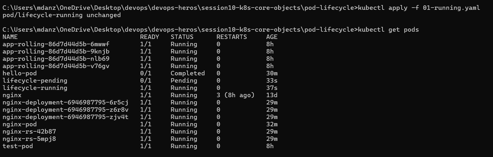
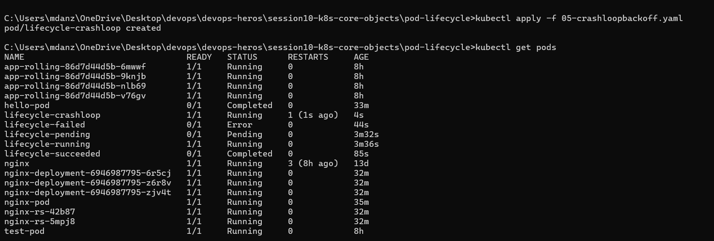
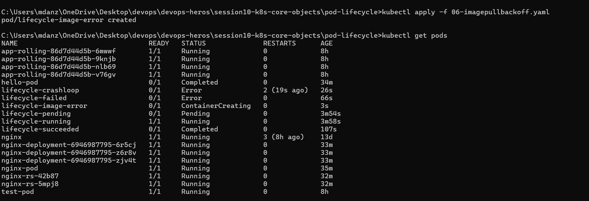
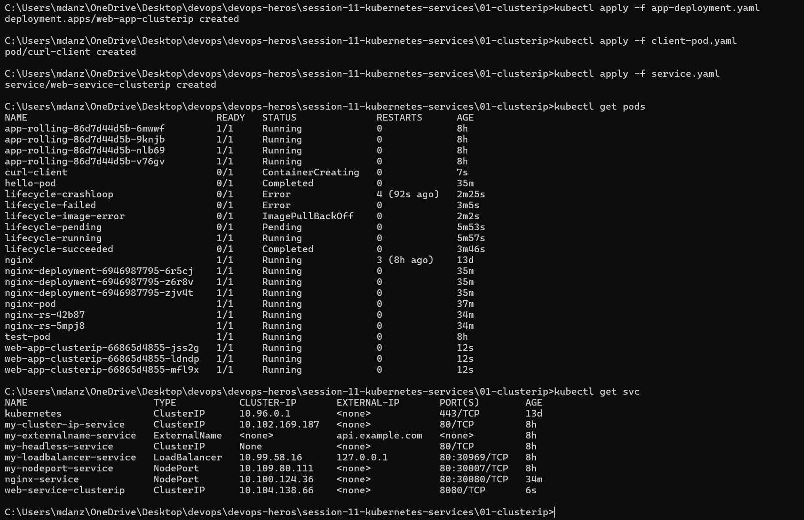
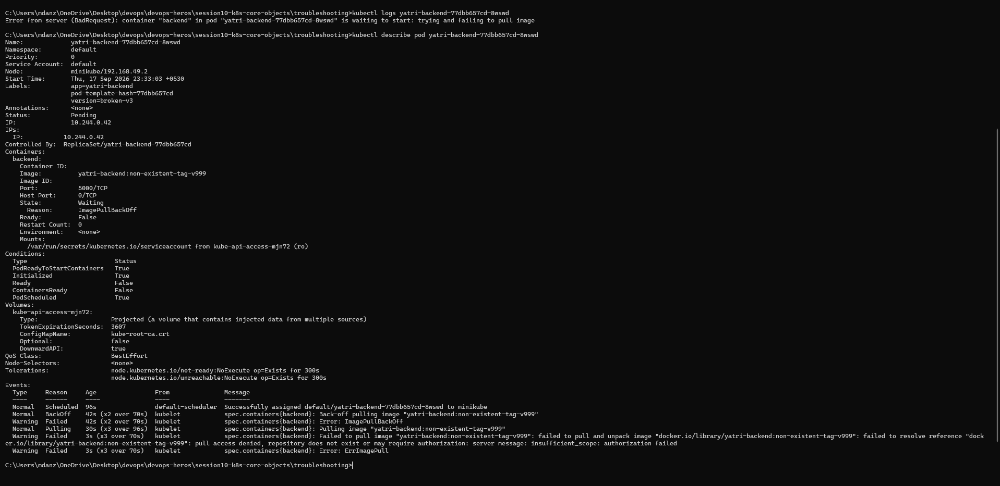

### Muhammad Anzar Ahmad(24bcs10289)

## 1. Kubernetes Networking Overview


## 2. Pod Running



## 3. Pod Pending


## 4. Pod Succeeded


## 5. Pod Failed


## 6. CrashLoopBackOff



## 7. ImagePullBackOff



## 8. Port Forwarding




## 9. Deployment


## 10. Troubleshooting




## 11. Selector Mismatch


## 12. ReplicaSet Scaling


## The Need for Kubernetes Services

- Pod IP addresses are temporary and can change whenever Pods are replaced, restarted, or scaled.

- A Service provides a stable way to access Pods and automatically sends traffic to matching healthy Pods.

Normal application traffic should not depend on a Pod IP. A Deployment may remove and create Pods during an update, which can give them new IP addresses. The Service name stays the same and sends the request to a ready Pod.

The Service decides which Pods to use from their labels. If the selector is `app: web`, the selected Pods must have the label `app: web`. A wrong label does not stop the Service from being created, but it leaves the Service with no backend Pods.

## Port Concepts

Kubernetes uses several port fields, and each one has a different job. A request normally follows this path:

```text
client to nodePort to Service port to targetPort on the Pod
```

### containerPort

`containerPort` records the port that the container expects to use. This field alone does not publish the application. The process inside the container must actually listen on that port.

### targetPort

`targetPort` tells the Service which port to use on the selected Pod. This is normally the port where the application is listening.

### port

`port` is the port that other Pods use when they call the Service. It does not have to be the same number as `targetPort`.

### nodePort

`nodePort` makes a port available on the cluster nodes. A request can enter through a node IP and then be passed to the Service. This is handy for a local lab, but it is not usually the first choice for a production web application.

For example, these values mean that an outside request enters on port 30080, the Service listens on 8080, and the application receives it on port 80:

```text
node IP port 30080 to Service port 8080 to Pod port 80
```

## ClusterIP

- ClusterIP gives the application a stable internal address inside the cluster.

- It is a normal choice for traffic between a frontend, backend, and database.

ClusterIP is the default Service type. It is meant for internal traffic, so a frontend can call the backend by its Service name instead of following individual Pod IPs.

```bash
kubectl get service
kubectl get endpointslice
```

When no ready Pod matches the selector, the EndpointSlice has no usable backend for the request.

## NodePort

- NodePort makes one chosen port available on each node.

- It is most useful for development, testing, and small local setups.

In Minikube, the node may run inside a container or virtual machine. The node IP is not always reachable from the host, so this command can provide a usable local URL:

```bash
minikube service <service-name> --url
```

If the node can be reached directly, the address normally looks like `http://<node-ip>:<node-port>`.

## LoadBalancer

- LoadBalancer asks an external platform for a public address.

- It is used when an application must accept traffic from outside the cluster.

In a cloud cluster, the provider normally creates the external address. The Service still selects Pods in the usual way. In Minikube, there is no cloud provider, so the address may remain pending until `minikube tunnel` is running.

```bash
minikube tunnel
kubectl get service
```

For several HTTP applications, one shared Ingress or Gateway can be a better choice than one public load balancer per Service.

## ExternalName

- ExternalName makes a Kubernetes Service name point to an outside domain through DNS.

- It is useful when an application needs to call an API or service that is not running in the cluster.

This type does not select Pods and does not receive a normal ClusterIP. DNS returns an alias for the outside name. The external server still needs the correct host name and TLS configuration.

```yaml
apiVersion: v1
kind: Service
metadata:
  name: external-api
spec:
  type: ExternalName
  externalName: api.example.com
```

## Headless Service

- A Headless Service does not have one virtual IP. DNS can return the addresses of its matching Pods.

- It is useful with StatefulSets and other systems that need to contact individual Pods.

Set `clusterIP: None` to create a headless Service. DNS then returns ready Pod addresses rather than one Service address. This is useful when each database or StatefulSet member has a separate role.

```yaml
apiVersion: v1
kind: Service
metadata:
  name: web-headless
spec:
  clusterIP: None
  selector:
    app: web
  ports:
    - port: 80
      targetPort: 80
```

## Service Without a Selector

A Service can also be created without a selector. This is useful for an application outside the cluster, such as a database on an older server.

Since Kubernetes has no Pod labels to check in this case, an administrator must create an EndpointSlice with the real backend address. That address must point to a reachable system.

## DNS and Service Names

CoreDNS creates the DNS records used by Services. A Pod can usually call a Service in the same namespace with its short name:

```text
web-service
```

The longer form of the name follows this pattern:

```text
<service>.<namespace>.svc.<cluster-domain>
```

For example:

```text
web-service.default.svc.cluster.local
```

The short name works inside the same namespace. For a Service in another namespace, include that namespace in the name. The Pod's DNS settings can be seen in `/etc/resolv.conf`.

These commands are useful when checking DNS:

```bash
kubectl get pods -n kube-system
kubectl exec <pod-name> -- nslookup <service-name>
kubectl exec <pod-name> -- cat /etc/resolv.conf
```

If a lookup fails, check the Pod, the CoreDNS Pods, and the spelling of the Service and namespace first.

## Deployment, StatefulSet, and DaemonSet

These controllers are used for different kinds of workloads:

| Controller | Best use | Pod identity |
| --- | --- | --- |
| Deployment | Stateless web apps and APIs | Pod names are generated and can change |
| StatefulSet | Databases and apps that need stable identity | Pods keep ordered names such as `web-0` |
| DaemonSet | Node-level agents such as log collectors | Usually one Pod runs on each eligible node |

A Deployment works well when the replicas are interchangeable. A StatefulSet is better when each replica needs a fixed name or its own storage. A DaemonSet is used when a support process should run on every eligible node.

## Selector Mismatch

One common Service problem is a selector that does not match the Pod labels. The Service may exist normally, but requests fail because it has no ready endpoints.

Check both sides with:

```bash
kubectl get service <service-name> -o yaml
kubectl get pods --show-labels
kubectl get endpointslice
```

The Service selector and the labels in the Pod template must agree. After correcting them, wait for the Pods to become ready and inspect the EndpointSlice again.

## Minikube Networking

Minikube uses a local driver to run the Kubernetes node. With the Docker driver, that node can sit inside a separate Docker network. As a result, a NodePort or LoadBalancer may behave differently from one in a cloud cluster.

For a NodePort Service, use:

```bash
minikube service <service-name> --url
```

For a LoadBalancer Service, use:

```bash
minikube tunnel
```

In another terminal, check the Service address with:

```bash
kubectl get service <service-name>
```

This is usually caused by the local Minikube network, not by an error in the Service file.

## Choosing a Service Type

- Use ClusterIP for normal traffic inside the cluster.
- Use NodePort for simple access during local testing.
- Use LoadBalancer when the platform can provide a public address.
- Use ExternalName when a cluster name should point to an outside domain.
- Use a Headless Service when clients need the addresses of individual Pods.
